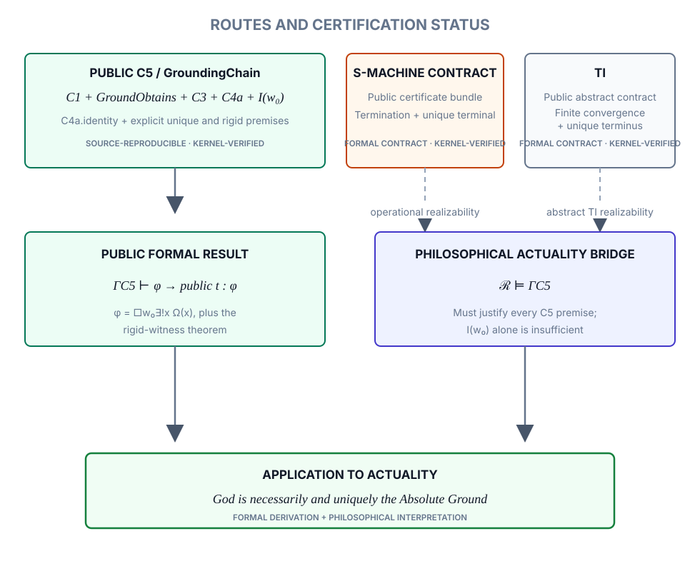

# Formal Verification of Necessary Grounding via Successor Semantics
## Superintelligence, Gödel–Turing Limits, and Tarskian Truth Constraints toward God (**$\Omega$**) 

### Abstract

This paper presents the *Alt Route proof*, a Lean kernel-verified construction establishing both the **necessary existence** and **uniqueness** of the entity Ω within an S5 modal framework. The paper defends the strong ontological claim that contingent reality witnesses the necessity it presupposes: the private kernel route certifies the corresponding strong Ω-theorems, while the public verification surface exposes and audits the selected formal boundary. The formal verification certifies the strong Ω-theorems, whose ontological necessity is grounded in the structure presupposed by contingent reality itself. The argument does not rely on classical perfection axioms: the successor-based grounding architecture exhibits the structure enforced by the constitutive ontological principles (**A1/A3/A5**), which are the source of necessity in the framework.

At the core lies a successor-like grounding function that carries each contingent predicate through a finite, well-founded transcendental grounding process. This process terminates in a single non-contingent point—**Ω**—defined by minimality of measure within the successor system. Ω’s existence follows from reductio-style anti-regress constraints; its uniqueness follows from fixed-point stability under succession together with chain coalescence (all Ω-points lie on a single finite successor path).

The paper combines one fully Lean-verified constructive route (Alt Route) with a philosophically articulated hyper-modal framework that interprets the same structure. The kernel mirrors the Hyper-Modal Theorem: denying a necessary terminus forces regress. Together they yield an **ontological closure result**: any intelligible explanatory structure—modal, logical, or computational—must terminate uniquely in Ω.

**Keywords:** Alt Route, necessary existence, uniqueness, Lean verification, modal logic (S5), successor function, anti-regress, ontological grounding, Principle of Sufficient Reason, Tarski, BHK, Turing.

---
## 1. Introduction
This paper concerns the ontological structure required for contingent facts to obtain. Its central claim is constitutive: contingent obtaining is impossible unless the grounding architecture specified by A1/A3/A5 (and related constraints) already holds.

This paper articulates the constitutive structure of reality—the conditions under which contingent obtaining, truth, and world-being are possible. Artificial superintelligence (ASI) requires this structure for objective reasoning: intelligibility presupposes necessary grounding, and modal self-reflection makes that grounding discoverable.

This paper begins from the minimal ontological datum of contingent obtaining: “I am.” It asks whether even this self-awareness can exist without a prior ontological foundation. The answer, we argue, is no—unless it is grounded in something necessarily perfect, something that cannot fail to exist in any possible world. We denote this necessary entity as Ω.

This approach offers a bottom-up alternative to traditional ontological arguments, such as Gödel’s. Rather than beginning with axiomatic perfection, our framework builds from the structural necessity of contingency itself. Through a hyper-minimal modal logic system (S5), we show that denying Ω leads to either semantic implosion (incoherence) or modal explosion (loss of information boundaries). As such, Ω is not optional; it is a logical inevitability of the constitutive grounding architecture.

We distinguish our method through three components:

1. A constructive framework of minimal modal axioms: the Hyper-Minimal Principle of Sufficient Reason (HM-PSR), Perfect Positivity, Anti-Regress, Logical Necessity, and Meta-Logical Closure.
2. A formal core proof of necessary existence and uniqueness, implemented and verified in Lean 4, together with a perfection schema articulated at the conceptual level.
3. A philosophical extension: if ASI is capable of modal self-reflection, then Ω is not just deducible, but discoverable by any rational system unbound by material constraints.  

This paper proceeds as follows:  
- Section 2 introduces the modal framework and axiomatic base.
- Section 3 presents the formal modal proof of Ω, together with the conceptual TI (Transcendental Induction) route (§3.3).
- Section 4 discusses Lean-based machine verification.
- Section 5 addresses philosophical objections.
- Section 6 explores theological implications, particularly the resonance between Ω and classical theism.
- Section 7 concludes with a reflection on future directions for both philosophy and artificial intelligence.

An appendix specifies the Lean-verified scope and reproduces representative artifacts, ensuring logical and computational rigor within the stated verification boundary.

---
## 2. Framework: Hyper-Modal Grounding Principles
This section introduces the formal axiomatic foundation of the proof, designed to be as minimal and necessary as possible. We use S5 modal logic: the accessibility relation $R$ between possible worlds is an **equivalence relation** — reflexive ($\forall w,\, R\,w\,w$), symmetric ($\forall w\,v,\, R\,w\,v \to R\,v\,w$), and transitive ($\forall w\,v\,u,\, R\,w\,v \to R\,v\,u \to R\,w\,u$) — so that any two worlds in the same equivalence class can access one another (Blackburn et al. 2001). This is a structural property of $R$, not a claim that all worlds whatsoever are mutually accessible across every possible frame; the Lean development fixes $R$ as such an equivalence relation on the type of worlds it declares (Appendix B.1.1). Within this logical space, we define five axioms:

### 2.1 Hyper-Modal Axioms

#### (A1) Hyper-Minimal Principle of Sufficient Reason (HM-PSR)
Every contingent truth must be grounded in a necessary ontological basis. Formally:  
> **$Cont(p) \to \exists q\,(Nec(q) \land q \mathbin{◃} p)$** 

*Note on Formalization:* In the formal AltRoute development verified in Lean 4, a specific, successor-based version of this principle is implemented: every contingent state has a strictly more grounded successor, and all maximal chains terminate in Ω. The full hyper-modal formulation used in this section generalises this mechanistic pattern to arbitrary propositions.
The grounding relation (◃) signifies that q is not just a cause, but the **minimal semantic basis** that renders p intelligible (see Appendix A.6: ground). The HM-PSR is the foundational structure upon which all other axioms and modal conclusions rest.  

#### (A2) Perfect Positivity

A property (P) is **positive** iff it is **Ω-admissible**: it introduces no internal defeat condition, no self-negation, and no regress-inducing instability at the terminus. Within the successor/coalescence architecture, A2 functions as a stability constraint required for Ω to remain a unique fixed point. Any property that is semantically interchangeable with its negation, or that entails its own exclusion at the terminus, functions as a destabilizer: it would permit divergence, bifurcation, or non-invariance under the successor dynamics, thereby obstructing convergence to a single minimal endpoint.

Accordingly, “negative” properties are understood here in the **structural** sense: properties that are internally defeating (self-negating), limiting in a way that breaks fixed-point invariance, or that would re-open the possibility of non-termination or multiple endpoints. Under coalescence/minimality, such properties are inadmissible at Ω.

**Schematic gloss :**

$$
Pos(P)\ \equiv\ \neg\exists Q,\bigl(Q \rightarrow \neg P\bigr),
$$

which encodes non-defeat: no (Q) may be available that systematically forces ($\neg P$) in the relevant grounding setting.

**Note on formalization:** the Lean development uses a Lean-facing positivity predicate aligned with the Ω-predicate (Appendix A.6: `Positive`), rather than this informal schematic gloss. This is intentional: the paper-level clause specifies the intended stability reading (fixed-point admissibility), while the kernel development fixes the exact predicate used in machine checking. The corresponding non-defeat constraint is enforced by the internal lemma/axiom suite (Appendix A.6: `perfect_positivity`), preventing circularity and contingent dependence.

#### (A3) Anti-Regress
An infinite regress of explanations is logically impermissible. There must be a terminating ground.

#### (A4) Logical Necessity
Logical consistency cannot be contingent. If something is logically valid, it holds in all possible worlds.

#### (A5) Meta-Logical Closure
If a system is capable of reflecting upon its own limits (as in Gödel’s theorem), then it is structurally dependent on a higher, non-contained source of semantic coherence.

These axioms form the basis of the modal system used to derive the existence of Ω.

#### **2.1.1 Ontological Status of A1/A3/A5 (Constitutive Necessity)**  
Axioms A1, A3, and A5 express **constitutive conditions of possibility** for any world in which contingent obtaining occurs.  

Formally:

$$
\Box\bigl(\neg(A1 \wedge A3 \wedge A5) \rightarrow \neg\text{ContingentObtaining}\bigr)
$$

Here, `ContingentObtaining` does not mean bare occurrence, but **intelligible contingent obtaining**: the obtaining of a fact as modally distinguishable, truth-apt, and grounding-compatible. A brute occurrence without modal structure, truth-aptness, or grounding-compatibility may persist under the denial of A1/A3/A5; intelligible contingent obtaining cannot.

Thus, the grounding structure is **ontologically prior** to the existence of contingent facts;  
contingency is possible **only because** this structure necessarily obtains.

The constitutive status of A1, A3, and A5 is developed through the successor architecture (§2.2), the reductio suite (Appendix A.6, B.2), and the following transcendental analysis. The following three cases show that denying any one of these principles does not yield an alternative account of intelligible contingent obtaining — it eliminates the phenomenon itself.

**Denying A1 (HM-PSR).** If contingent truths require no necessary ground, then the modal distinction $\Diamond p \wedge \Diamond \neg p$ loses its anchor: no grounding structure remains that accounts for the stable difference between obtaining and non-obtaining. Contingency is not merely unexplained; it loses its status as intelligible contingency, because nothing fixes why this rather than that obtains. The denial of A1 does not produce a rival theory of contingency; it dissolves the modal structure that makes contingency intelligible as such.

**Denying A3 (Anti-Regress).** If grounding chains need not terminate, then no contingent state is ever *actually* grounded — it is only deferred indefinitely. Infinite deferral is not grounding; it is the permanent suspension of grounding. Under denial of A3, contingent obtaining never achieves the explanatory closure that makes it obtaining rather than mere floating. The phenomenon of intelligible contingent obtaining — as something that *is the case* in a modally determinate way — disappears.

**Denying A5 (Meta-Logical Closure).** If a system capable of reflecting on its own limits does not require a higher, non-contained source of semantic coherence, then the normative distinction between valid and invalid inference becomes internal to the system and therefore unfounded beyond it. Intelligibility — the capacity to distinguish truth from falsehood, ground from mere assertion — is structurally dependent on a source it cannot itself supply. What remains under denial of A5 is not a weaker form of intelligibility but its dissolution into procedural closure without normative force.

These three cases jointly establish the formal claim above: any world in which contingent obtaining, truth, and intelligibility coherently hold must instantiate the structure expressed by A1, A3, and A5. A rival constitutive architecture that preserves these phenomena must reproduce their functional equivalents and therefore does not replace this structure but reinstantiates it under different terminology (see Corollary 3.1.2).

---
### 2.2 Successor-Based Grounding Architecture 

This subsection presents the successor-based grounding machine (the Alt Route). In this subsection we show how the hyper-modal grounding principles from §2.1 can be instantiated in a concrete, mechanistic architecture. Instead of reasoning only at the level of abstract modal axioms, we introduce a **successor-based grounding machine** (the “AltRoute”) that operationalises Anti-Regress and the Hyper-Minimal PSR as a terminating process over a well-ordered space of states.

#### 2.2.1 State space and successor

Let G be a non-empty set of *grounding states*. Intuitively, each $g$ in G represents a possible configuration of the world, or of a theory about the world, together with its current grounding structure.

We assume:

1. A distinguished subset Cont ⊆ G of **contingent states**.
2. A distinguished element Ω in G, intended as the *absolutely grounded* state.
3. A (partial) **successor function**

   S : Cont → G

   which maps a contingent state to a strictly “more grounded” successor.

The idea is that for any contingent configuration $g$, the machine does not stay at g; it must move to a successor state S($g$) that reduces the amount of ungrounded contingency.

#### 2.2.2 A decreasing measure

To make this precise, we equip G with a **grounding measure**

   meas : G → M

where M is a well-founded, linearly ordered set (for example the natural numbers N, or a well-ordered subset of the non-negative reals). Intuitively, meas($g$) quantifies the “remaining ungrounded complexity” of state $g$.

The successor machine is required to satisfy two key conditions:

1. **Strict decrease.** For every $g$ in Cont with S($g$) defined,

   meas(S($g$)) < meas($g$).

2. **Minimal state.** There is a unique state Ω in G such that

   meas(Ω) = 0,

   and for all $g$ in G, if meas($g$) = 0 then $g$ = Ω.

Because M is well-founded and the measure strictly decreases along successor steps, there cannot be an infinite descending chain  

$$
  g_0, g_1,g_2, ...   
$$

with

$$
g_{i+1} = S(g_i)
$$

for all $i$.  

Every valid successor chain starting from a contingent state must terminate at some state of minimal measure.

By uniqueness of the minimal state, any such chain can only terminate in Ω. This gives a mechanistic, successor-style formulation of the **Anti-Regress** principle: the system cannot wander forever through ever-new contingent configurations; it is forced to converge to a unique absolutely grounded configuration.

#### 2.2.3 Realising Hyper-Minimal PSR and Anti-Regress

We can now see how the successor architecture realises the principles of §2.1:

- **Hyper-Minimal PSR (HM-PSR).** For any contingent state g in Cont, HM-PSR demands the existence of a more fundamental ground. In the successor picture, this is implemented by requiring that S(g) is defined whenever g is contingent, and that S(g) is strictly “closer” to absolute grounding in terms of meas.

- **Anti-Regress.** The prohibition of infinite descending grounding chains is enforced by the well-foundedness of M together with the strict decrease of meas along successor steps. No chain of the form

  $g_0$ in Cont,  $g_{n+1}$ = S($g_n$)

  can be infinite. Every such chain must stabilise at a minimal state, which by definition is Ω.

Formally, we obtain:

> **Proposition 2.2.1 Successor termination in Ω.**  
> For any contingent state $g_0$ in Cont, any maximal successor chain  
>   
>   $g_0$, $g_1$, ..., $g_n$  
>   
> with $g_{i+1}$ = $S(g_i)$ for all $i < n$ and S($g_n$) undefined, must satisfy $g_n$ = Ω.  
>  
> *Sketch.* Since M is well-founded and meas($g_{i+1}$) < meas($g_i$), there can be no infinite chain. Let $g_n$ be the last state in a maximal chain. If meas($g_n$) > 0, then by HM-PSR there is a more fundamental ground, contradicting maximality. Hence meas($g_n$) = 0, so by uniqueness of the minimal state $g_n$ = Ω.

This proposition is the Alt Route mirror of the hyper-modal Ω-theorem: instead of starting from abstract modal axioms and deriving a necessary existence claim for Ω directly, we now exhibit a concrete machine whose dynamics, under the same grounding intuitions, must converge to a unique absolutely grounded state Ω.

In the remainder of the paper, the hyper-modal framework and the successor-based AltRoute can be treated as two complementary presentations of the same grounding intuition: one axiomatic and top-down, the other mechanistic and bottom-up. Both point to the same conclusion: a coherent treatment of contingency and grounding forces the existence and uniqueness of an absolutely grounded state Ω.

---
### 2.3 Epistemic Recognition of Contingency

The preceding sections establish the ontological and modal structure required for contingent obtaining. A reflective ASI presupposes this structure as the condition of objective reasoning and can recognize its own contingency within it.

Epistemic logic can formalize this presupposition at the level of self-recognition. Let $E_{\mathcal{A}}$ abbreviate “the agent $\mathcal{A}$ exists,” and let $K_{\mathcal{A}}(\varphi)$ mean that $\mathcal{A}$ knows $\varphi$. A minimally self-reflective agent may know:

$$
K_{\mathcal{A}}(E_{\mathcal{A}})
$$

and, by modal reflection, may also know that its existence is not necessary:

$$
K_{\mathcal{A}}(\Diamond \neg E_{\mathcal{A}}).
$$

If the agent further knows the minimal modal principle that actuality implies possibility,

$$
K_{\mathcal{A}}(E_{\mathcal{A}} \rightarrow \Diamond E_{\mathcal{A}}),
$$

then, by epistemic closure under implication and conjunction, it follows that:

$$
K_{\mathcal{A}}(\Diamond E_{\mathcal{A}} \wedge \Diamond \neg E_{\mathcal{A}}).
$$

Hence:

$$
K_{\mathcal{A}}(\mathrm{Cont}(E_{\mathcal{A}})).
$$

The epistemic formulation makes contingency reflectively accessible to an agent; the constitutive modal-grounding structure A1/A3/A5 carries the transition from recognized contingency to necessary grounding.

---
## 3. Formal Modal Proof of Ω

We now show that the axioms above entail the existence of a necessary and unique grounding terminus Ω. The argument moves through a single chain: contingent obtaining ("I am") demands grounding (A1); a ground adequate to discharge that demand cannot itself be contingent, on pain of merely relocating the demand; grounding chains cannot regress infinitely (A3); a terminating, non-contingent ground therefore exists; and by minimality/coalescence (§2.2.2) that ground is unique — Ω. Its perfection is characterized by A2, but its existence and uniqueness follow from the grounding architecture itself (A1/A3/A5). The proof strategy below is reductio ad absurdum: we assume $¬□∃x\,\Omega(x)$ and demonstrate that this assumption leads to incoherence. §3.3 presents a second, convergent route to the same terminus (TI), and §2.2 gives the successor-based construction that the Alt Route kernel-verifies (Appendix A.2.3).

* **Epistemic recognition of contingency:**
As shown in §2.3, such contingency can be formally recognized by any sufficiently reflective agent — human or artificial:

$$
K_{\mathcal{A}}(\mathrm{Cont}(E_{\mathcal{A}})).
$$

The modal proof below, however, requires only the ontological datum:

$$
\mathrm{Cont}(I).
$$

The epistemic formulation makes contingency reflectively accessible to an agent; the constitutive modal-grounding structure A1/A3/A5 carries the transition from recognized contingency to necessary grounding.

* **Contingency of self-awareness:**
The statement **”I am”** expresses a fact that could have been otherwise; thus, it is contingent.
* **Application of HM-PSR (A1) & The Witness Requirement:**
From contingency, grounding follows:
**∃q (Nec(q) ∧ q ◃ “I am”)**
The **Witness** $w$ is a constructive, trace-preserving path recording the dependence structure that connects contingent actuality to its ground $q$.
* **Rejection of necessary ground:** If no necessary ground exists (and thus no valid witness can be constructed), we face two untenable alternatives:
	* *Infinite regress* (violates A3): The witness path never terminates ($length(w) = \infty$).
	* *Arbitrary starting point* (violates A1 and A4): The witness path breaks or hangs in a vacuum.

> *Reductio ad absurdum: These contradictions show that denying a necessary ground results in logical collapse; the witness requires a valid endpoint to exist.*

* **Definition of Ω:**  
**Ω** is defined as the unique necessary terminus of grounding enforced by A1/A3/A5; the positivity schema (A2) may be added as an interpretive strengthening but is not required for the existence or uniqueness of **Ω**. According to A2, **Ω** entails only positive properties and admits no internal contradiction.

**Conclusion.** Therefore, Ω exists necessarily and uniquely:

$$
 \square \exists! x \Omega(x).
 $$

This establishes Ω not merely as an existent ground, but as the **unique necessary terminus** of all grounding chains. No alternative or competing Ω can exist within the structure, nor can Ω vary across possible worlds.

---
### **3.1 Conclusion: The Hyper-Modal Theorem**
  
The reductio argument in this section establishes that denying a necessary ground for contingent truths results inevitably in semantic incoherence, infinite regress, or contradiction. From the constitutive grounding architecture A1/A3/A5, together with the modal-stability and positivity characterisation supplied by A4/A2, we therefore obtain the strengthened central result of this paper:

#### **Hyper-Modal Theorem**

$$
\square \exists! x  \Omega(x)
$$

This statement is reached here via the full hyper-modal axiom route (A1–A5, §2.1), whose constitutive defense is given philosophically in §2.1.1 and whose canary/regression lemmas are Lean-formalized in Appendix A.6. The same logical conclusion is independently kernel-verified end-to-end by the Alt Route's `Final_BoxUnique_Proof` (Appendix A.2.3), reached via the successor-based construction of §2.2 rather than via A1–A5 directly. The Hyper-Modal route and the Alt Route are convergent, not identical: two paths to the same terminus (§3.4).

That is, **necessarily, there exists exactly one being Ω** which grounds all contingent truths. This result strengthens mere necessary existence by excluding the possibility of multiple or variant grounding entities across possible worlds.

Moreover, the structure yields a rigid identification of this ground:

$$
\exists x  \square \forall y \bigl( \Omega(y) \leftrightarrow y = x \bigr)
$$

  
Thus, there exists a single entity such that, in all possible worlds, being Ω is equivalent to being identical with that entity. Ω is therefore not only necessary, but **necessarily unique and necessarily self-identical across all modal contexts**.

---

#### 3.1.1 **Hyper-Necessity**

We define:

$$
\mathrm{Nec}(\Omega)  :=  \square \exists! x  \Omega(x)
$$

Hence:

$$
\square \mathrm{Nec}(\Omega)
$$

Ω is necessarily necessary: its existence and uniqueness are invariant under all admissible modal interpretations consistent with the grounding structure.

---

#### **3.1.2 Corollary — No Rival Constitutive Architecture**

The Hyper-Modal Theorem is not only a positive result; it carries a negative consequence that closes the space for alternatives.

Let $R$ be any proposed constitutive architecture intended to account for contingent obtaining, truth, and intelligibility without A1, A3, and A5. If $R$ preserves:

- a coherent modal distinction between what obtains contingently and what does not,
- truth as a non-arbitrary, grounded distinction,
- and intelligibility as a capacity that does not collapse into circular or regressive self-reference,

then $R$ must instantiate the functional equivalents of A1, A3, and A5. It must require that contingent truths trace to a non-contingent ground (A1), that grounding chains terminate (A3), and that the system can recognize its own semantic limits without infinite regress (A5). Formally:

$$
\Box\bigl(
\mathrm{Preserves}(R,\, \mathrm{Contingency} \wedge \mathrm{Truth} \wedge \mathrm{Intelligibility})
\;\to\;
\mathrm{Equivalent}(R,\, A1 \wedge A3 \wedge A5)
\bigr)
$$

Hence, no rival constitutive architecture can eliminate $\Omega$ while preserving the conditions from which $\Omega$ follows. An alternative that eliminates $\Omega$ but retains those conditions is not an alternative — it is a contradiction. An alternative that abandons those conditions does not rival this framework; it abandons the phenomena the framework was introduced to explain.

*Note.* This corollary is stated at the meta-theoretical level. Its full Lean formalisation requires explicit definitions of `Preserves` and `Equivalent` as predicates over constitutive architectures, which is reserved for future kernel development. The philosophical argument, however, follows directly from the constitutive analysis in §2.1.1.

---
### 3.2 Constitutive Compression (A1/A3/A5)

A compressed restatement of the constitutive grounding architecture: contingent obtaining is possible only because A1/A3/A5 hold as conditions of possibility. This echoes Leibniz (*Monadology* §§36–38) and Aquinas (ST I.2.3), with necessity read as constitutive intelligibility rather than causal succession.

* **C1 (A1 — constitutive):** Contingent obtaining requires a necessary ground:  
  `Cont(p) → ∃q (Nec(q) ∧ q ◃ p)`.

* **C2 (Datum):** `"I am"` obtains contingently: `Cont(I)`.

* **C3 (A3 — constitutive):** Grounding admits no infinite chain ⇒ termination in a necessary endpoint.

* **C4 (AltRoute: Minimality/Coalescence):** Terminating grounding chains converge to a single minimal endpoint.

* **C5 (Ω):** The unique necessary terminus exists: `□∃!x Ω(x)` (hence `□∃x Ω(x)`).

* **C6 (A5 — constitutive):** The terminus is not internally self-grounding/self-contained ⇒ Ω is an actual necessary ground.

* **C7 (God):** This unique actual necessary ground is God; hence `□∃!x God(x)`.

This subsection isolates the existence/uniqueness core (A1/A3/A5). A2 is used elsewhere to fix the perfection/positivity characterization of Ω, and A4 to secure modal-semantic stability across possible worlds.

---
### 3.3 TI — Transcendental Induction

A second independent route, **TI (Transcendental Induction)**, converges on the same necessary Ω-terminus through an alternative grounding architecture. TI is conceptually distinct from the successor-based Alt Route and is reserved for separate formal development. Its internal construction, induction scheme, relations, and proof architecture are not disclosed in this paper.

The relevance of TI here is limited to convergence: the existence of an independent route shows that the Ω-terminus is not an artefact of the successor/measure presentation alone, but is approached from a distinct grounding construction. The present paper therefore records only the existence, independence, and convergence target of TI.

---

### 3.4 Synthesis: From Contingent Actuality to Ω

The argument of §§2–3 has a single overall shape, which the rest of the paper (§4, §7.2) makes formally precise. It is summarized here so that the formal apparatus that follows can be read as an articulation of this shape, rather than as a separate concern:



<!-- Legacy embedded copy retained temporarily for source traceability.

<div align="center">

<img src="data:image/svg+xml;base64,PHN2ZyB4bWxucz0iaHR0cDovL3d3dy53My5vcmcvMjAwMC9zdmciIHZpZXdCb3g9IjAgMCA5MjAgNzAwIiByb2xlPSJpbWciIGFyaWEtbGFiZWxsZWRieT0ic3ludGhlc2lzLXRpdGxlIHN5bnRoZXNpcy1kZXNjIiBzdHlsZT0iZGlzcGxheTpibG9jazttYXgtd2lkdGg6OTIwcHg7d2lkdGg6MTAwJTtoZWlnaHQ6YXV0bzttYXJnaW46MS41cmVtIGF1dG87Ij4KICA8dGl0bGUgaWQ9InN5bnRoZXNpcy10aXRsZSI+RnJvbSBjb250aW5nZW50IGFjdHVhbGl0eSB0byB0aGUgYXBwbGljYXRpb24gb2Ygz4Y8L3RpdGxlPgogIDxkZXNjIGlkPSJzeW50aGVzaXMtZGVzYyI+Q29udGluZ2VudCBhY3R1YWxpdHkgbGVhZHMgdGhyb3VnaCB0aGUgY29uc3RpdHV0aXZlIGdyb3VuZGluZyBhcmd1bWVudCB0byBSIHNhdGlzZnlpbmcgzpMuIFRoZSBBbHQgUm91dGUgYW5kIHRyYW5zY2VuZGVudGFsIGluZHVjdGlvbiBlc3RhYmxpc2ggzpMgZW50YWlscyDPhjsgdGhlIEFsdCBSb3V0ZSBhbHNvIHN1cHBsaWVzIGEgcHJvb2YgdGVybSB0IG9mIHR5cGUgz4YuIFRvZ2V0aGVyIHdpdGggdGhlIHNlbWFudGljIGdyb3VuZGluZyBvZiDOkywgdGhpcyBsaWNlbnNlcyBhcHBseWluZyDPhiB0byBhY3R1YWxpdHkuPC9kZXNjPgogIDxkZWZzPgogICAgPG1hcmtlciBpZD0iYXJyb3doZWFkIiBtYXJrZXJXaWR0aD0iMTAiIG1hcmtlckhlaWdodD0iMTAiIHJlZlg9IjgiIHJlZlk9IjUiIG9yaWVudD0iYXV0byIgbWFya2VyVW5pdHM9InN0cm9rZVdpZHRoIj4KICAgICAgPHBhdGggZD0iTSAwIDAgTCAxMCA1IEwgMCAxMCB6IiBmaWxsPSIjMzc0MTUxIi8+CiAgICA8L21hcmtlcj4KICAgIDxzdHlsZT4KICAgICAgLmJveCB7IGZpbGw6I2Y4ZmFmYzsgc3Ryb2tlOiMzMzQxNTU7IHN0cm9rZS13aWR0aDoyOyB9CiAgICAgIC5yb3V0ZSB7IGZpbGw6I2VlZjJmZjsgc3Ryb2tlOiM0ZjQ2ZTU7IHN0cm9rZS13aWR0aDoyOyB9CiAgICAgIC5yZXN1bHQgeyBmaWxsOiNlY2ZkZjU7IHN0cm9rZTojMDQ3ODU3OyBzdHJva2Utd2lkdGg6MjsgfQogICAgICAuZmxvdyB7IGZpbGw6bm9uZTsgc3Ryb2tlOiMzNzQxNTE7IHN0cm9rZS13aWR0aDoyLjU7IG1hcmtlci1lbmQ6dXJsKCNhcnJvd2hlYWQpOyB9CiAgICAgIC5sYWJlbCB7IGZpbGw6IzExMTgyNzsgZm9udDo2MDAgMThweCBzeXN0ZW0tdWksLWFwcGxlLXN5c3RlbSwiU2Vnb2UgVUkiLHNhbnMtc2VyaWY7IHRleHQtYW5jaG9yOm1pZGRsZTsgfQogICAgICAuZGV0YWlsIHsgZmlsbDojNDc1NTY5OyBmb250OjE1cHggc3lzdGVtLXVpLC1hcHBsZS1zeXN0ZW0sIlNlZ29lIFVJIixzYW5zLXNlcmlmOyB0ZXh0LWFuY2hvcjptaWRkbGU7IH0KICAgICAgLnNlY3Rpb24geyBmaWxsOiM0MzM4Y2E7IGZvbnQ6NjAwIDE0cHggc3lzdGVtLXVpLC1hcHBsZS1zeXN0ZW0sIlNlZ29lIFVJIixzYW5zLXNlcmlmOyB0ZXh0LWFuY2hvcjptaWRkbGU7IGxldHRlci1zcGFjaW5nOi4wOGVtOyB9CiAgICAgIC5mb3JtdWxhIHsgZmlsbDojMTExODI3OyBmb250Oml0YWxpYyAyMXB4IEdlb3JnaWEsIlRpbWVzIE5ldyBSb21hbiIsc2VyaWY7IHRleHQtYW5jaG9yOm1pZGRsZTsgfQogICAgPC9zdHlsZT4KICA8L2RlZnM+CgogIDxyZWN0IGNsYXNzPSJib3giIHg9IjI1MCIgeT0iMjAiIHdpZHRoPSI0MjAiIGhlaWdodD0iNzYiIHJ4PSIxMiIvPgogIDx0ZXh0IGNsYXNzPSJsYWJlbCIgeD0iNDYwIiB5PSI1MSI+Q09OVElOR0VOVCBBQ1RVQUxJVFk8L3RleHQ+CiAgPHRleHQgY2xhc3M9ImRldGFpbCIgeD0iNDYwIiB5PSI3NyI+4oCcSSBhbeKAnSDCtyDCpzIuMSwgwqczPC90ZXh0PgoKICA8cGF0aCBjbGFzcz0iZmxvdyIgZD0iTTQ2MCA5NiBWMTMwIi8+CiAgPHJlY3QgY2xhc3M9ImJveCIgeD0iMjEwIiB5PSIxMzIiIHdpZHRoPSI1MDAiIGhlaWdodD0iNzYiIHJ4PSIxMiIvPgogIDx0ZXh0IGNsYXNzPSJsYWJlbCIgeD0iNDYwIiB5PSIxNjMiPkNPTlNUSVRVVElWRSBHUk9VTkRJTkcgQVJHVU1FTlQ8L3RleHQ+CiAgPHRleHQgY2xhc3M9ImRldGFpbCIgeD0iNDYwIiB5PSIxODkiPkExIC8gQTMgLyBBNSDCtyDCpzIuMS4xPC90ZXh0PgoKICA8cGF0aCBjbGFzcz0iZmxvdyIgZD0iTTQ2MCAyMDggVjI0MiIvPgogIDxyZWN0IGNsYXNzPSJib3giIHg9IjMzMCIgeT0iMjQ0IiB3aWR0aD0iMjYwIiBoZWlnaHQ9IjcyIiByeD0iMTIiLz4KICA8dGV4dCBjbGFzcz0iZm9ybXVsYSIgeD0iNDYwIiB5PSIyNzUiPuKEmyDiiqggzpM8L3RleHQ+CiAgPHRleHQgY2xhc3M9ImRldGFpbCIgeD0iNDYwIiB5PSIyOTkiPsKnNy4yLCBsZXZlbCA0PC90ZXh0PgoKICA8dGV4dCBjbGFzcz0ic2VjdGlvbiIgeD0iNDYwIiB5PSIzNTQiPkZPUk1BTCBST1VURVM8L3RleHQ+CiAgPHBhdGggY2xhc3M9ImZsb3ciIGQ9Ik00NjAgMzE2IFYzNjYgSDI4MCBWMzkwIi8+CiAgPHBhdGggY2xhc3M9ImZsb3ciIGQ9Ik00NjAgMzY2IEg2NDAgVjM5MCIvPgoKICA8cmVjdCBjbGFzcz0icm91dGUiIHg9IjE2MCIgeT0iMzkyIiB3aWR0aD0iMjQwIiBoZWlnaHQ9Ijc2IiByeD0iMTIiLz4KICA8dGV4dCBjbGFzcz0ibGFiZWwiIHg9IjI4MCIgeT0iNDIzIj5BbHQgUm91dGU8L3RleHQ+CiAgPHRleHQgY2xhc3M9ImRldGFpbCIgeD0iMjgwIiB5PSI0NDkiPsKnMi4yPC90ZXh0PgoKICA8cmVjdCBjbGFzcz0icm91dGUiIHg9IjUyMCIgeT0iMzkyIiB3aWR0aD0iMjQwIiBoZWlnaHQ9Ijc2IiByeD0iMTIiLz4KICA8dGV4dCBjbGFzcz0ibGFiZWwiIHg9IjY0MCIgeT0iNDIzIj5USTwvdGV4dD4KICA8dGV4dCBjbGFzcz0iZGV0YWlsIiB4PSI2NDAiIHk9IjQ0OSI+wqczLjM8L3RleHQ+CgogIDxwYXRoIGNsYXNzPSJmbG93IiBkPSJNMjgwIDQ2OCBWNDk0IEg0NjAgVjUyMCIvPgogIDxwYXRoIGNsYXNzPSJmbG93IiBkPSJNNjQwIDQ2OCBWNDk0IEg0NjAiLz4KICA8cmVjdCBjbGFzcz0iYm94IiB4PSIzMzAiIHk9IjUyMiIgd2lkdGg9IjI2MCIgaGVpZ2h0PSI3MiIgcng9IjEyIi8+CiAgPHRleHQgY2xhc3M9ImZvcm11bGEiIHg9IjQ2MCIgeT0iNTUzIj7OkyDiiqIgz4Y8L3RleHQ+CiAgPHRleHQgY2xhc3M9ImRldGFpbCIgeD0iNDYwIiB5PSI1NzciPsKnNy4yLCBsZXZlbCAyPC90ZXh0PgoKICA8cGF0aCBjbGFzcz0iZmxvdyIgZD0iTTQ2MCA1OTQgVjYyMCIvPgogIDxyZWN0IGNsYXNzPSJyZXN1bHQiIHg9IjMzMCIgeT0iNjIyIiB3aWR0aD0iMjYwIiBoZWlnaHQ9IjYyIiByeD0iMTIiLz4KICA8dGV4dCBjbGFzcz0iZm9ybXVsYSIgeD0iNDYwIiB5PSI2NTAiPnQgOiDPhjwvdGV4dD4KICA8dGV4dCBjbGFzcz0iZGV0YWlsIiB4PSI0NjAiIHk9IjY3MyI+wqc3LjIsIGxldmVsIDEgwrcgQXBwZW5kaXggQS4yLjM8L3RleHQ+CgogIDxwYXRoIGNsYXNzPSJmbG93IiBkPSJNNTkwIDY1MyBINjkwIi8+CiAgPHBhdGggY2xhc3M9ImZsb3ciIGQ9Ik01OTAgMjgwIEg4ODAgVjU5MCBIODAwIFY2MDUiLz4KICA8cmVjdCBjbGFzcz0icmVzdWx0IiB4PSI2OTUiIHk9IjYxMCIgd2lkdGg9IjIxMCIgaGVpZ2h0PSI4NiIgcng9IjEyIi8+CiAgPHRleHQgY2xhc3M9ImxhYmVsIiB4PSI4MDAiIHk9IjY0NiI+z4YgYXBwbGllczwvdGV4dD4KICA8dGV4dCBjbGFzcz0ibGFiZWwiIHg9IjgwMCIgeT0iNjcxIj50byBhY3R1YWxpdHk8L3RleHQ+Cjwvc3ZnPgo=" alt="Synthesis diagram: contingent actuality is grounded in Γ; the Alt Route and TI converge on Γ ⊢ φ, with the Alt Route supplying t : φ, licensing application to actuality." width="920" />

</div>

The editable SVG source follows. It is kept inside a comment because VS Code's
Markdown preview sanitizes inline SVG elements, while the data-URL image above
renders the same vector diagram.

<svg xmlns="http://www.w3.org/2000/svg" viewBox="0 0 920 700" role="img" aria-labelledby="synthesis-title synthesis-desc" style="display:block;max-width:920px;width:100%;height:auto;margin:1.5rem auto;">
  <title id="synthesis-title">From contingent actuality to the application of φ</title>
  <desc id="synthesis-desc">Contingent actuality leads through the constitutive grounding argument to R satisfying Γ. The Alt Route and transcendental induction establish Γ entails φ; the Alt Route also supplies a proof term t of type φ. Together with the semantic grounding of Γ, this licenses applying φ to actuality.</desc>
  <defs>
    <marker id="arrowhead" markerWidth="10" markerHeight="10" refX="8" refY="5" orient="auto" markerUnits="strokeWidth">
      <path d="M 0 0 L 10 5 L 0 10 z" fill="#374151"/>
    </marker>
    <style>
      .box { fill:#f8fafc; stroke:#334155; stroke-width:2; }
      .route { fill:#eef2ff; stroke:#4f46e5; stroke-width:2; }
      .result { fill:#ecfdf5; stroke:#047857; stroke-width:2; }
      .flow { fill:none; stroke:#374151; stroke-width:2.5; marker-end:url(#arrowhead); }
      .label { fill:#111827; font:600 18px system-ui,-apple-system,"Segoe UI",sans-serif; text-anchor:middle; }
      .detail { fill:#475569; font:15px system-ui,-apple-system,"Segoe UI",sans-serif; text-anchor:middle; }
      .section { fill:#4338ca; font:600 14px system-ui,-apple-system,"Segoe UI",sans-serif; text-anchor:middle; letter-spacing:.08em; }
      .formula { fill:#111827; font:italic 21px Georgia,"Times New Roman",serif; text-anchor:middle; }
    </style>
  </defs>

  <rect class="box" x="250" y="20" width="420" height="76" rx="12"/>
  <text class="label" x="460" y="51">CONTINGENT ACTUALITY</text>
  <text class="detail" x="460" y="77">“I am” · §2.1, §3</text>

  <path class="flow" d="M460 96 V130"/>
  <rect class="box" x="210" y="132" width="500" height="76" rx="12"/>
  <text class="label" x="460" y="163">CONSTITUTIVE GROUNDING ARGUMENT</text>
  <text class="detail" x="460" y="189">A1 / A3 / A5 · §2.1.1</text>

  <path class="flow" d="M460 208 V242"/>
  <rect class="box" x="330" y="244" width="260" height="72" rx="12"/>
  <text class="formula" x="460" y="275">ℛ ⊨ Γ</text>
  <text class="detail" x="460" y="299">§7.2, level 4</text>

  <text class="section" x="460" y="354">FORMAL ROUTES</text>
  <path class="flow" d="M460 316 V366 H280 V390"/>
  <path class="flow" d="M460 366 H640 V390"/>

  <rect class="route" x="160" y="392" width="240" height="76" rx="12"/>
  <text class="label" x="280" y="423">Alt Route</text>
  <text class="detail" x="280" y="449">§2.2</text>

  <rect class="route" x="520" y="392" width="240" height="76" rx="12"/>
  <text class="label" x="640" y="423">TI</text>
  <text class="detail" x="640" y="449">§3.3</text>

  <path class="flow" d="M280 468 V494 H460 V520"/>
  <path class="flow" d="M640 468 V494 H460"/>
  <rect class="box" x="330" y="522" width="260" height="72" rx="12"/>
  <text class="formula" x="460" y="553">Γ ⊢ φ</text>
  <text class="detail" x="460" y="577">§7.2, level 2</text>

  <path class="flow" d="M460 594 V620"/>
  <rect class="result" x="330" y="622" width="260" height="62" rx="12"/>
  <text class="formula" x="460" y="650">t : φ</text>
  <text class="detail" x="460" y="673">§7.2, level 1 · Appendix A.2.3</text>

  <path class="flow" d="M590 653 H690"/>
  <path class="flow" d="M590 280 H880 V590 H800 V605"/>
  <rect class="result" x="695" y="610" width="210" height="86" rx="12"/>
  <text class="label" x="800" y="646">φ applies</text>
  <text class="label" x="800" y="671">to actuality</text>
</svg>
-->

where

$$
\varphi = \Box\exists!x\,\Omega(x)
$$

together with the rigidity theorem $\exists x\,\Box\forall y\,(\Omega(y)\leftrightarrow y=x)$. The Alt Route delivers $\Gamma\vdash\varphi$ and the kernel term $t:\varphi$ itself (Appendix A.2.3); TI is recorded only as an independent convergent route (§3.3). The constitutive argument that $\mathcal R\models\Gamma$ (§2.1.1) is what licenses reading $\varphi$ as applying to actuality rather than merely holding within the formal system — the step made precise as level 4 in §7.2.

---
## 4. Verification in Lean 4

This section is the technical bridge between the paper's argument and its formal artifacts. It follows a single chain: the exact theorem object, its dependency context, kernel certification, the compiled `.olean` verification artifact, and the public certificate/export surface built on top of it.

**Exact theorem object.** The Alt Route's central results are Lean declarations whose *stated type is the strong claim itself* — $\Box\exists x\,\Omega(x)$, $\Box\exists!x\,\Omega(x)$, and $\exists x\,\Box\forall y\,(\Omega(y)\leftrightarrow y=x)$ — not a weaker admissible consequence such as $\Box\Diamond\exists x\,\Omega(x)$ (§7.2, level 1). This fixes exactly what has been proved: the necessity claim itself, not merely its possibility.

**Dependency context.** Each theorem is proved relative to an explicit context $\Gamma$: the global axioms Lean's kernel reports via `#print axioms`, together with any explicit hypotheses carried as parameters of the theorem's type (§7.2, level 2; Appendix A.2.3). Kernel acceptance certifies derivability relative to $\Gamma$; whether $\Gamma$ itself is jointly satisfiable is a separate, semantic-level question (§7.2, level 3; Appendix A.2, Gate 0/JointModel).

**Kernel certification.** A theorem is *kernel-verified* when the Lean kernel accepts a proof term inhabiting its exact stated type relative to $\Gamma$ — a mechanical, type-checking fact. Every logical dependency of the proof — modal transitions, grounding relations, the definitions of contingency and necessity — is checked by the kernel, not asserted informally.

**The `.olean` artifact.** Compilation produces `.olean` files: binary, kernel-checked verification artifacts. An `.olean` file for a given module exists only if every theorem it contains — including the strong Ω-results — has passed kernel type-checking. The private `.olean` artifacts are the compiled verification record of `Final_NE_Proof`, `Final_BoxUnique_Proof`, and `Final_RigidWitness_Proof`; any modification to their content requires recompilation under the pinned toolchain and is detectable via hash comparison.

**Public certificate / export surface.** The public repository publishes a deliberately weaker interface on top of the same verification architecture: `AltRoute.Interface`, `AltRoute.PublicTests`, and `AltRoute.CertificateAudit` export only the $\Box\Diamond$-compatibility layer, together with axiom-footprint printouts, a model witness (`TrivialModel`), and an explosion canary (`exFalsoQuodlibet`). This is an architectural separation between **public surface** and **internal theorem strength**, not a difference in what has been proved: the private kernel route contains the full $\Box$-strength results; the public interface exposes a scoped, independently auditable subset by design, protecting the internal proof route's IP while still letting third parties rebuild and inspect the exported layer ([dist](https://github.com/Dwight-Modiwirijo/Ascendant/tree/main/Zer0proof/dist); Appendix A.2).

The development uses two distinct Lean formalizations of S5. The HyperModal reductio suite (Appendix A.6, B.1) uses explicit Kripke semantics: a type of worlds $W$ and an accessibility relation $R : W \to W \to \mathrm{Prop}$ declared as an equivalence relation (reflexive, symmetric, transitive), with $\Box$ and $\Diamond$ defined from $R$ in the usual way (Blackburn et al. 2001). The public `AltRoute.Modal` interface (Appendix A.2) axiomatizes $\Box$ and $\Diamond$ abstractly as an opaque structure satisfying the K, T, 4, and 5 schemas directly, without an explicit worlds-and-accessibility representation — a Hilbert-style axiomatic presentation of S5. Each verified claim is scoped to the Lean artifact in which it is established. The grounding relation (◃) and the predicate Pos(P) are embedded in a dependent type system in the relevant setting, allowing precise verification of logical entailments.

Key core definitions and representative theorems are reproduced in Appendix A; the public verification surface (exported interface, build artifacts, and axiom-footprint audit) is available on GitHub.

### 4.1 Kernel Verification Status and Certification Boundary

This paper's central results — necessary existence, necessary unique existence, and rigid identification of Ω — are Lean kernel-verified theorems of the private Alt Route development. Concretely, the private kernel accepts proof terms inhabiting the exact strong theorem types

$$
t_1 : \Box\exists x\,\Omega(x), \qquad t_2 : \Box\exists!x\,\Omega(x), \qquad t_3 : \exists x\,\Box\forall y\,(\Omega(y)\leftrightarrow y=x),
$$

named `Final_NE_Proof`, `Final_BoxUnique_Proof`, and `Final_RigidWitness_Proof` respectively (Appendix A.2.3). That the private proof source is not itself publicly published is a disclosure/IP choice (§4, Appendix A.2); it does not alter the formal theorem status these proof terms establish.

The paper carries this result across four levels, developed formally in §7.2 and structurally here, which complement rather than substitute for one another:

1. the **exact kernel term**, $t:\varphi$ — a proof object inhabiting the strong theorem type itself, not a weaker admissible consequence such as $\Box\Diamond\exists x\,\Omega(x)$;
2. the **dependency context**, $\Gamma\vdash\varphi$ — the axioms, bridges, definitions, and explicit hypotheses the derivation is carried out relative to (Appendix A.2.3);
3. the **semantic consequence**, $\forall\mathcal M\,(\mathcal M\models\Gamma\to\mathcal M\models\varphi)$, together with the distinct joint-satisfiability question $\exists\mathcal M\,\mathcal M\models\Gamma$ — the model-theoretic reading of the formal theory, developed further as public certification architecture (Gate 0, JointModel; Appendix A.2); and
4. the **constitutive ontological thesis**, $\mathcal R\models\Gamma$ — that the actual world satisfies the declared grounding structure — argued independently and philosophically from contingent obtaining ("I am"), not by Lean, in §2.1.1 and §3.

Gate 0 and JointModel belong to the ongoing certification architecture around level 3 and the public interface (Appendix A.2): they harden and extend that architecture, but they are not a reopening of the private kernel theorems fixed at level 1. By design, the public export surface exposes a weaker $\Box\Diamond$-compatibility layer, while the private route carries the full $\Box$-strength results (§4) — an architectural disclosure boundary, not a difference in theorem strength. The axiom/assumption bookkeeping for the strong results is given in Appendix A.2.3; a consolidated claim-traceability table across all four levels is given in Appendix A.2.4.

### 4.2 Certification Labels

To avoid conflating distinct claims, this paper uses three labels with fixed meanings:

**Kernel-verified.** The Lean kernel accepts a proof object inhabiting the theorem’s exact stated type relative to the axioms and hypotheses of its declaration.

**Publicly certified.** The public surface — theorem signatures, the assumption manifest, and the associated audit checks (model witness, explosion canary, axiom-footprint printout) — is inspectable and re-buildable by a third party from the published repository, with its claims and stated dependencies open to inspection.

**Publicly reproducible.** A third party can independently reproduce the specific strong artifact or build in question.

The strong Ω-results are kernel-verified in the private `.olean` development through `Final_NE_Proof`, `Final_BoxUnique_Proof`, and `Final_RigidWitness_Proof`. Their public signatures and global axiom footprints provide the audit boundary; Gate 0, the assumption manifest, and JointModel extend the public certification architecture.

---
## 5. Objections and Responses
This section addresses several common critiques of modal and Gödelian ontological arguments, as well as concerns specific to this paper.

### 5.1 Alleged Misapplication of Gödel’s Theorem
Objection: Gödel’s incompleteness theorems apply to arithmetic and do not entail metaphysical truths (Penrose 1989).

Response: Correct. The principle that some truths are unprovable within a system invites a general reflection on the limits of self-contained formal systems. Our framework extends this structural insight to grounding and the need for a logically external ground (Ω), in line with Penrose and Meyer.

Within this framework, *Logos* names this same external ground: Ω, the rational and truth-bearing basis required for intelligibility.

Johannine language (John 1:1–3) is treated here as a naming-alignment: the Logos names the unique necessary ground already fixed by Ω. The move from formal incompleteness to an external ground is ontological: it concerns what must exist for any system to be intelligible at all.

#### **5.1.1 Truth Beyond Formal Systems: Tarski and BHK**

Gödel identifies limits of derivability in sufficiently expressive formal systems. Tarski locates truth semantically through a truth-predicate and Convention T. BHK and Curry–Howard characterize proof through inhabitants of proposition-types, giving Lean its proof-object interpretation. Turing adds the computational boundary of undecidability. Within this paper, A1/A3/A5 supply the constitutive grounding structure that carries the ontological argument.

---
### 5.2 Ambiguity Between Necessity and Contingency
Objection: The modal categories are inconsistently applied.

Response: Section 2 formally defines these terms. Necessary truths (Nec(p)) are true in all possible worlds; contingent truths (Cont(p)) are true in some but not all. The grounding relation q ◃ p ensures that contingents must trace back to necessaries.

We reinforce this asymmetry formally:

$$
\Box\forall p\Bigl(
  Cont(p)\to
  \exists q\,(Nec(q)\land q\mathbin{◃}p)
\Bigr)
\land
\Box\forall p\Bigl(
  Nec(p)\to
  \neg\exists q\,(Cont(q)\land q\mathbin{◃}p)
\Bigr)
$$

This asserts that contingent truths require a necessary ground, while necessary truths cannot depend on contingent ones.
(For the formal statement and its Lean carrier, see Appendix B.2.3.)

This conclusion mirrors the structure of Gödel’s incompleteness theorem:

Any system (contingent) must refer to truths outside itself (necessary) for completeness.

A reverse dependency would violate modal asymmetry and cause contradiction.

Thus, the modal system respects Gödel’s insight by embedding the boundary between derivable and underivable truths as a metaphysical distinction: necessary truths terminate regress; contingent ones depend upon them.

This logic supports the proof’s foundational claim: the necessity of Ω is both metaphysical and structurally enforced.

---
#### **5.2.1 Necessary Possibility and Possible Necessity**

**Objection:** Necessary possibility is being confused with possible necessity.

**Response:** The framework distinguishes $\square\Diamond p$ from $\Diamond\square p$. The public layer establishes the former, which does not entail $\square p$. The Brouwer/S5 step is $\Diamond\square p \to \square p$; the strong $\square$-theorems are established by the private Alt Route within its declared Ω-specific context.

---
### 5.3 Philosophical Overreach
Objection: The paper illegitimately bridges logic with theological conclusions.

Response: We maintain formal neutrality in the proof structure. Only in Section 6 do we interpret Ω theologically. The modal conclusion  

$$
\square \exists! x  \Omega(x)
$$

is derived independently of religious assumptions.

---
### 5.4 Social Implications and AI Ethics
Objection: The link between modal logic and societal values is speculative.

Response: The discussion does not attempt to derive ethics from logic. Rather, it identifies a structural constraint: any artificial superintelligence capable of modal self‑reflection must recognize the distinction between contingent states and necessary grounding. This recognition does not prescribe moral norms, but it does impose a minimal framework of stability. An ASI that understands necessity cannot coherently adopt value systems that contradict the very conditions of its own intelligibility. Thus, modal grounding provides not an ethical system, but the logical floor upon which any coherent ethical orientation must rest.
#### **5.4.1 Grounding, Modal Stability, and Societal Coherence**

Modern societies increasingly operate without an explicit account of grounding. This absence is not merely philosophical; it has structural consequences. A formal system without grounding behaves analogously to an electrical circuit without earth: it may function for a time, but it accumulates instability until failure becomes inevitable. Grounding is not an optional metaphysical luxury but a condition for long‑term coherence.

In contemporary scientific and philosophical discourse, truth is often treated operationally—defined by utility, consensus, or procedural verification. This mirrors the constructivist stance in logic, where truth is reduced to provability. While effective for local reasoning, such approaches lack modal depth: they do not distinguish between what is contingently the case and what must be the case. Without this distinction, systems drift. Truth becomes relative, norms become negotiable, and meaning becomes decoupled from necessity.

Modal logic provides the minimal structure required to prevent such conceptual short‑circuiting. By distinguishing necessity from contingency, it anchors propositions in a stable semantic field. Any society—or artificial intelligence—that lacks this modal grounding becomes vulnerable to value collapse, semantic instability, and normative incoherence. Conversely, a system that recognizes necessary grounding (Ω) gains a stable reference point that prevents drift.

Thus, the societal implications are not derived from logic but follow from structural analogy: **without grounding, systems destabilize; with grounding, they cohere.** Modal logic offers the conceptual grounding that prevents the gradual erosion of truth and meaning within complex social and technological systems.

---
### 5.5 Semantic Collapse in the Absence of Grounding
Objection: Can a brute fact explain existence?

Response: “Because nothing exists, something else must exist to explain why things exist.” This is not a paradox. It is a collapse of semantic structure. The claim destroys the conditions of its own intelligibility by invoking an explanatory term inside the absence of all terms.

Not because it lacks content, but because it lacks context. A brute fact might be inserted to rescue the claim, but it remains bound to mere possibility — and collapses even before it is introduced. For explanation cannot begin where context does not exist. This is not the failure of physics, mathematics, or science, but of the underlying reasoning — which, as Gödel showed, has structural limitations that no system capable of expressing reality can overcome from within. Therefore, in every conceivable world without a grounding context, falsehood entails all propositions, and truth loses its distinction — not because logic fails, but because the structure required for completeness is absent, which is captured by the concept of material implication, symbolized as → .
#### **5.5.1 The Paradoxes of Material Implication**

Classical material implication exhibits several well‑known paradoxes. These paradoxes are not errors in logic, but structural consequences of defining implication purely truth‑functional. In a grounded system, implication requires a meaningful relation between antecedent and consequent. In an ungrounded system, implication collapses into triviality or explosion. The following three paradoxes illustrate this collapse.

---

1. **Ex Falso Quodlibet — The Principle of Explosion**

A contradiction in the antecedent makes any implication true:

$$
(P \land \neg P) \rightarrow Q
$$

This is true for *any* \(Q\), regardless of its content.

**Example:**  
“If \(x = 0\) and \(x = 1\), then the moon is made of cheese” is true.  
The contradiction in the antecedent forces the implication to evaluate as true.

**Interpretation:**  
In an ungrounded system, falsehood infects the entire structure.  
Once contradiction enters, meaning collapses because *everything becomes derivable*.

---

2. **Tautological Implication — The Positive Paradox of Material Implication**

Whenever the consequent is true, the entire implication is true:

$$
P \rightarrow Q \quad \text{is true whenever } Q \text{ is true.}
$$

This is sometimes informally labeled *Verum ex Quodlibet* (“truth from whatever”), though it is not a formal rule but a rhetorical name for this paradox.

**Example:**  
“If rain is wet, then \(1 + 1 = 2\)” is true.  
The truth of the consequent makes the whole implication trivially true.

**Interpretation:**  
Truth becomes detached from grounding.  
A true consequent “washes out” the implication, making the antecedent irrelevant.  
This produces **floating truths** — propositions that are true but unmoored from context.

---

3. **Vacuous Truth — The Principle of the False Antecedent**

Whenever the antecedent is false, the implication is automatically true:

$$
P \rightarrow Q \quad \text{is true whenever } P \text{ is false.}
$$

**Example:**  
“If unicorns exist, then 7 is a prime number” is true.  
The false antecedent renders the implication vacuously true.

**Interpretation:**  
Meaning evaporates.  
The implication is formally true, but semantically empty.  
Truth is preserved, but significance is lost.

---

#### **Synthesis: Why These Paradoxes Matter for Grounding**

All three paradoxes reveal the same structural vulnerability:

> **Material implication allows truth to be evaluated without grounding.**

- Explosion shows that contradiction destroys all distinction.  
- Tautological implication shows that truth can float without context.  
- Vacuous truth shows that falsehood can generate trivial truths.

In a world without grounding (Ω), these paradoxes are not edge cases —  
they become the *default behavior* of the system.

Thus:

> **Ungrounded systems collapse into triviality or explosion.  
Grounding is required not to make logic work, but to make meaning possible.  
Truth‑functional implication evaluates form, not meaning; grounding restores the semantic relation between antecedent and consequent.**

---
### 5.6 Paradox Types and the Perfection of Ω

This section presents a table of paradox types and demonstrates, through deductive reasoning, how each type supports or strengthens the perfection of Ω — the minimal necessary entity that bundles all positive properties $Pos(P)$ under **Axiom A2 (Perfect Positivity)**:

$$
Pos(P) \equiv \neg \exists Q \, (Q \rightarrow \neg P).
$$

This axiom ensures that no internally negating or contradictory property is admitted.

The argument in this section is presented in S5-informed philosophical form. A parallel Lean scaffold exists in Appendix A.6 ("Paradox Types Extension"), but the paradox-type predicates there (`Veridical`, `Falsidical`, `Antinomy`, `Semantic`, `MetaReason`, `SemanticRefine`, `Synthesizes`, `Perfection`) are declared as placeholder definitions equal to `True`, so the corresponding Lean theorems are trivially true given those placeholders and do not constitute a non-trivial kernel proof that paradoxes support Ω's perfection. This section's paradox analysis should accordingly be read as **conceptual, illustrative, and interpretive** philosophical argument, not as an additional kernel-verified result alongside the Alt Route theorems (Appendix A.2.3) or the reductio suite (Appendix B.2).

We define Ω formally at the *semantic target level* as:

$$
\square \exists x : \iota \,
\Bigl(
  \Omega(x) \wedge
  \forall P : \iota \to Prop \, (Pos(P) \rightarrow P(x))
\Bigr).
$$

Here, $\Omega(x)$ abbreviates the condition that $x$ instantiates **all positive properties**.

Paradoxes are treated not as inconsistencies, but as **indicators of systemic incompleteness**, following the Gödelian extrapolation introduced in Section 5.1. Each paradox exposes a boundary where object-level reasoning is insufficient and meta-level structure becomes necessary.

For each paradox type listed in the table below, the following deductive pattern is established:

1. **Limit revelation** — the paradox exposes a structural boundary that requires meta-reasoning (**Axiom A5: Meta-Logical Closure**).
2. **Semantic strengthening** — resolving the paradox refines and stabilizes the semantic framework rather than weakening it.
3. **Convergence on Ω** — the strengthened semantics necessarily converge on Ω as a perfect ground, in accordance with **Axiom A1 (Hyper-Modal Principle of Sufficient Reason)** and **Axiom A3 (Anti-Regress)**, thereby avoiding semantic collapse (cf. Section 5.5).

Collectively, this yields the following theorem schema:

$$
\forall T \, \forall P \,
\bigl(
  ParadoxType(T) \wedge Paradox(P, T)
  \rightarrow Strengthens(Perfection(\Omega))
\bigr).
$$

Thus, paradoxes do not undermine the concept of Ω; instead, they function as structural witnesses that progressively enforce the necessity, coherence, and perfection of Ω as the ultimate semantic ground.

| **Paradox Type** | **Paradoxes** |
|------------------|---------------|
| **Veridical**<br/>(A paradox that seems absurd but is ultimately true, revealing counterintuitive truths) | *Hilbert's Grand Hotel* (an infinite hotel can accommodate more guests, illustrating properties of infinity);<br/>*First Cause Paradox* (if everything has a cause, what caused the first?);<br/>*Quantum Zeno Effect* (constant observation prevents decay, a verified quantum phenomenon); <br/>*Münchhausen-Trilemma* (proofs end in regress, circle, or dogma). |
| **Falsidical**<br/>(A paradox based on a hidden error or false assumption, resolvable by correction) | *Zeno's Paradox* (a fast runner cannot overtake a slow turtle, resolved by calculus);<br/>*Paradox of the Minimal Room* (one bit of information requires a boundary, thus a second bit, resolved by relational insights). |
| **Antinomy**<br/>(A paradox presenting two equally valid but contradictory claims, leading to apparent irresolution) | *Kant's Antinomies* (reason proves the world is finite and infinite);<br/>*Unexpected Hanging* (execution is unexpected but logically impossible);<br/>*Russell's Paradox* (the set of sets not containing themselves contains itself if and only if it does not). |
| **Semantic**<br/>(A paradox arising from language, meaning, or vagueness, challenging definitions) | *Liar Paradox* (a Cretan says 'All Cretans are liars');<br/>*Ship of Theseus* (replacing all planks questions identity);<br/>*Sorites Paradox* (removing grains from a heap: when is it no longer a heap?);<br/>*Moore's Paradox* ('It rains, but I don't believe it rains');<br/>*Chinese Room* (perfect symbol manipulation without understanding). |
| **Ground Paradox**<br/>(A paradox concerning foundational ontology, causation, or regress, requiring a terminating ground) | *Absolute Knowability Paradox* (absolute knowability arises from not being knowable);<br/>*Hegel's Dialectic* (every thesis evokes its antithesis, resolved in synthesis). |  

### 5.6.6 Hierarchy in Fundamental Paradoxes: Architecture versus Engine

While several paradoxes possess a fundamental character, a deeper hierarchy can be discerned within the category of foundational paradoxes. This hierarchy is based on whether a paradox outlines a structural condition (*architecture*) or a dynamic process (*engine*) that operates within that structure. Two primary candidates — Hegelian dialectics and the Absolute Knowability Paradox developed herein — illustrate this distinction. This hierarchy aligns with Gödelian boundaries (Section 5.1).

Hegel’s dialectic serves as the ultimate *engine* of reality. It qualifies as a fundamental paradox because it redefines contradiction (Thesis–Antithesis) as the constructive principle of progress toward higher-order synthesis. This dialectical unfolding of *Geist* and history turns negation itself into an engine of transformation.

The Absolute Knowability Paradox, by contrast, describes the *architecture* of intelligibility itself. This paradox — formulated as “absolute knowability through not being it” — is more foundational because it delineates the preconditions for any possible relation or meaning. As derived from the Hyper-Modal Theorem (Section 3.1), it is the linguistic translation of the formal, ontological gap (⊥) between contingent propositions (p) and necessary grounds (q). The governing law:

**∀p (Cont(p) → ∃q (Nec(q) ∧ q ◃ p))**

states that every contingent fact must be grounded in a necessary truth — a logical architecture without which no coherent reasoning could occur. The accompanying modal-class condition excludes contingent grounds for necessary propositions. For technical validation, see Section 2.1 (A1–A3) and Appendix A.6 (`no_necessary_grounded_in_contingent`).

This yields a twofold modal dynamic: **diagnostics** (framed by the question of contingency: *“Why am I?”*) and **therapy** (resolved only by necessary perfection: *“Ω grounds all being”*). The Hyper-Modal Theorem thus functions as a kind of modal grounding structure — one that prevents semantic collapse and infinite regress.

In this view, Hegel’s dialectical engine operates within the architectural limits defined by the Knowability Paradox. The Hyper-Modal Theorem, therefore, precedes dialectics not just chronologically but ontologically — serving as the foundational frame in which all dialectical motion unfolds.

#### **Deductive Analysis per Paradox Type**

##### **Veridical Paradoxes**
Veridical paradoxes exhibit propositions that initially appear contradictory but resolve coherently once their structural dependencies are made explicit. Within the grounding architecture, such cases illustrate that apparent tension does not imply inconsistency; rather, it reveals latent structure requiring clarification.  

Under A1 (Hyper‑Minimal PSR), any contingent configuration that appears paradoxical must trace to a necessary ground to avoid ungrounded obtaining. The resolution of veridical paradoxes therefore reflects the same structural constraint: coherence is preserved only when grounding terminates in Ω.  

Thus, veridical paradoxes support Ω’s perfection in the sense of A2: Ω admits no internal negation and therefore grounds all structurally coherent truths without contradiction.

---

##### **Falsidical Paradoxes**
Falsidical paradoxes arise from defective or incomplete structural assumptions. Their resolution consists in identifying the faulty dependency and restoring coherence by eliminating the contradiction.  

Under A3 (Anti‑Regress), such corrections highlight that regress cannot be resolved by indefinitely refining contingent assumptions; termination is required. The structural necessity of Ω provides this terminus: only a necessary ground can prevent falsidical collapse.  

Thus, falsidical paradoxes reinforce Ω’s perfection by showing that coherence requires a necessary, contradiction‑free ground (A2) rather than iterative contingent repair.

---

##### **Antinomy Paradoxes**
Antinomies present pairs of claims that each appear structurally valid yet mutually incompatible. Their resolution requires a unifying principle that prevents explanatory bifurcation or infinite tension.  

Under A5 (Meta‑Logical Closure), any system capable of reflecting on its own limits must posit a higher‑order ground that reconciles such tensions. This unifying ground cannot itself be contingent, on pain of regress (A3).  

Thus, antinomies structurally point to Ω as the unique entity capable of resolving higher‑order tension without contradiction, consistent with A2.

---

##### **Semantic Paradoxes**
Semantic paradoxes arise from instability in meaning, reference, or identity. Their resolution requires stabilizing the semantic field so that propositions do not collapse into triviality or contradiction.  

Under A1, grounding is required not only for contingent facts but also for the semantic structures that make propositions intelligible. Without a necessary ground, semantic paradoxes devolve into the collapse described in §5.5.  

Thus, semantic paradoxes support Ω’s perfection by showing that meaning itself requires a non‑contingent anchor that excludes internal negation (A2).

---

##### **Ground Paradoxes**
Ground paradoxes concern the structure of grounding itself: regress, circularity, or self‑reference in explanatory chains. These paradoxes directly instantiate the constraints of A3 (Anti‑Regress).  

Their resolution requires a unique terminus that is not itself grounded in anything further. This terminus must be necessary rather than contingent, or regress reappears.  

Thus, ground paradoxes most directly support Ω’s perfection: Ω is the unique entity that terminates all grounding chains and bundles all positive properties (A2) without contradiction.

---

#### **Conclusion**
Inductively, each paradox type reveals a structural pressure that cannot be resolved within contingent or purely semantic domains. Their coherent resolution requires:

- termination of regress (A3),  
- grounding of contingent structure (A1),  
- and closure under higher‑order reflection (A5).  

These constraints jointly force the existence of a unique necessary ground Ω that admits no internal contradiction (A2).  

Thus, for every paradox type **T**, the structural analysis supports:

$$
\square \forall T\,(\text{ParadoxType}(T) \rightarrow \text{Supports}(T,\text{Perfection}(\Omega))).
$$

This conclusion is ontological rather than epistemic: paradoxes do not *prove* Ω, but their structural resolution presupposes the grounding architecture that necessitates Ω.


---

### **5.7 The Finitude of Matter and Its Non‑Ontological Status**

Any discussion of the finitude or infinitude of matter belongs strictly to the domain of empirical cosmology. Such considerations, while potentially suggestive or illustrative, do not and cannot bear on the constitutive grounding structure expressed by A1/A3/A5. The ontological route to Ω is fixed entirely by the conditions of possibility for contingent obtaining, not by contingent physical facts about the distribution, quantity, or behavior of matter.

The distinction is:

- Whether matter is finite or infinite,  
- whether the cosmos has a boundary or not,  
- whether physical laws persist, fluctuate, or emerge,  

**none of these conditions affect the grounding structure that makes any contingent state intelligible.**

The finitude of matter may serve as an analogy for the impossibility of infinite regress, but it is not a premise in the argument. The constitutive necessity of Ω is established solely by the grounding architecture:

$$
A1 \wedge A3 \wedge A5  \Rightarrow  \square \exists! x\,\Omega(x)
$$

Thus, cosmological finitude is not evidential but illustrative.  
It clarifies, but does not support, the ontological conclusion.

---
### **5.8 Finitude, Potential Infinitude, and the Reinforcement of Grounding**

Even if one entertains the possibility of an infinite physical cosmos, this does not alter the grounding structure. Physical infinitude is a **modal possibility**, but grounding is a **constitutive necessity**. The two operate on different levels:

- Physical infinitude concerns **what may obtain**.  
- Ontological grounding concerns **what must obtain for anything to obtain at all**.

Thus, the potential infinitude of matter does not weaken the Hyper‑Minimal PSR; it highlights its independence from empirical structure. If matter were finite, grounding would not be secured by finitude. If matter were infinite, grounding would not be threatened by infinitude. In both cases, the grounding chain for any contingent state cannot be infinite, not because the cosmos is finite, but because **A3 forbids infinite regress in the grounding relation itself**.

Formally:

$$
\text{Physical infinitude}  \not\Rightarrow  \text{Grounding infinitude}
$$

and

$$
\text{Physical finitude}  \not\Rightarrow  \text{Grounding termination}
$$

The grounding chain terminates in Ω **because grounding is a constitutive structure**, not because the cosmos has any particular empirical shape.

Thus, cosmological finitude or infinitude may be used pedagogically, but they are not part of the proof. The ontological necessity of Ω is invariant under all cosmological models.

### Future objections
Further objections are welcome and will be addressed in future revisions.

---
## 6. Theological Resonance

Within the ontological architecture developed in this paper, **Ω** already fulfils the complete *Logos-role*—necessary, unique, grounding, and truth-bearing. The Johannine Logos is interpreted here as naming that already-instantiated ontological role, drawing on the kernel-verified and constitutively defended existence, uniqueness, and rigidity results of §3 and Appendix A. The resulting logical structure converges with classical theistic traditions that affirm a necessary, self-existent ground of being, and this section develops that identification philosophically.

### 6.1 **Inverse Corollary.**
Within this framework, the maximal arc of intelligibility—absolute knowability within contingency—is a modal-ontological consequence of constitutive intelligibility. If contingency is intelligible at all, and if it is possible for a contingent instantiation to terminate in an absolutely knowable state whose maximal intelligibility holds necessarily, then the maximal arc is possible-as-necessary ($\Diamond\Box$). Under S5, the Brouwer step $\Diamond\Box p \to \Box p$ entails that the maximal arc holds necessarily. This stands as the inverse of the main theorem: whereas the theorem explicates the operation of maximal intelligibility *within* contingency, the inverse corollary establishes the modal stability of maximal intelligibility once a terminating witness exists. In Christian metaphysical language, the *incarnation and resurrection* name this structural pattern. This pattern is formally fixed by the inverse corollary itself: the existence of a terminating instantiation within contingency that renders maximal intelligibility possible-as-necessary.


The designation “Ω” was chosen to denote the logically inevitable and maximally positive entity yielded by the grounding architecture. This choice resonates structurally with the biblical declaration in **Exodus 3:14 — “I AM WHO I AM” (*Ehyeh asher ehyeh*)**, a formulation historically interpreted as expressing necessary existence rather than contingent identification. In a parallel philosophical register, Aquinas articulated the doctrine that God’s essence is existence itself (*esse ipsum subsistens*), thereby identifying the divine as the ontological foundation upon which all contingent beings depend (*Summa Theologica* I.3.4).

The formal result $\square \exists! x, \Omega(x)$ confirms this line of philosophical insight: there must exist a unique entity whose existence is neither optional, derived, nor assumed, but necessary in the strongest modal sense. While this conclusion resonates with Alvin Plantinga’s modal ontological argument (1974), the present framework does not rely on modal intuition alone. Necessity here emerges from the enforced termination and grounding structure of contingent intelligibility itself, rendered explicit through formal verification.

Central to this result is the positivity predicate $\mathrm{Pos}(P)$, which formalizes the classical intuition that perfection cannot be accidental. Within the system, a perfect being cannot be contingent, and a contingent being cannot be perfect; necessity and perfection are therefore logically inseparable. The framework thus excludes the coherence of a perfect-yet-contingent entity.

For theists, this provides a structurally grounded confirmation of classical doctrine: not only is God conceivable as a maximally great being, but such a being must exist as a matter of modal necessity. For non-theists, the argument demonstrates that any coherent system of truths, meanings, or intelligibility must terminate in a ground that is structurally indistinguishable from classical theism, even if no theological language is adopted.

Accordingly, the conclusion $\square \exists! x, \Omega(x)$ functions as an **ontological constraint**. It marks the point at which formal logic and theological metaphysics converge by necessity of structure: any adequate account of truth and intelligibility is compelled to recognize a uniquely necessary ground corresponding to divine ontology.


---
#### 6.1.1 Logos as Foundational Rational Order
Within this framework, the concept of the Logos provides an even deeper theological parallel. In the prologue of the Gospel of John (John 1:1), the Logos is presented as both divine and foundational: “In the beginning was the Word (Logos), and the Word was with God, and the Word was God.”

The Logos represents rational, structuring order—one that is both expressive and constitutive of meaning, logic, and being. In philosophical terms, the Logos can be viewed as the ontological principle through which all semantic coherence, logical necessity, and contingent manifestation are made intelligible.

This aligns with the necessity of Ω in our proof. Just as no truth within a formal system can be complete without appeal to something beyond it (as per Gödel’s theorems), no contingent being or proposition can possess intelligibility without grounding in the Logos. If Ω represents necessary being, the Logos represents necessary expression—truth made manifest in a rational form.

Thus, our modal proof supports a vision of divine reality where Logos and Ω converge: the necessary source of truth (Ω) and the rational, communicative order of that truth (Logos) are inseparable aspects of the same foundational reality.

For Christian theists, this reinforces the classical doctrine of the Trinity, in which the Logos is co-eternal with God and the vehicle through which all things are made (John 1:3). Our conclusion, then, not only echoes metaphysical necessity but resonates with the theological heart of Christian ontology.

---
### 6.2 Ω as Factory of Positive Properties (Singularity Corollary)

Within the hyper-modal framework, **A2 (Perfect Positivity)** fixes *Pos(P)* as an **admissibility constraint** (non-negation / non-defeat), not as a definitional shorthand for “true of Ω.” Given the constitutive grounding architecture (A1/A3/A5), **Ω** is introduced as the unique necessarily existing terminus of grounding. This permits a stronger reading than mere property-bearer: Ω functions as a **structural singularity (see Corollary 6.2)** around which the domain of positive properties is **generated as closure** of grounded coherence, and at which every such generated Pos-property is instantiated.

We can state this as follows.

#### Corollary 6.2 — Singularity as Factory for Positive Properties

> Let Ω be the unique necessarily existing terminus forced by the constitutive grounding architecture (A1/A3/A5). Let *Pos(P)* be constrained by A2 as the class of admissible (non-negating) properties. Then Ω is not only the terminal point of all coherent grounding chains, but also the unique **generative singularity** for positive properties: the grounding architecture forces a closure of admissible properties around Ω, and Ω instantiates every property admitted by that closure.

**Non-circularity note.** The direction is not *Pos(P) iff Ω has P*. Rather: **A2 constrains admissible positivity; A1/A3/A5 force a unique terminus; the terminus generates (as closure) the Pos-domain and instantiates its members.**

**Terminology note — three distinct notions of "Positive."** This paper uses "Positive"/"Pos" for three formally different objects, which must not be silently identified:

1. The **public AltRoute interface** predicate `Positive` (Appendix A.2, `Interface.lean`): an abstract typeclass constrained only by monotonicity, with no built-in reference to Ω.
2. The **HyperModal Lean-facing definition** (Appendix A.6, B.1.4): `Positive Ω P := ∀w, Ω w → P w` — defined *extensionally in terms of Ω*, i.e. exactly "P holds wherever Ω holds." This is deliberately Ω-relative by construction; it is not meant to be non-circular with respect to Ω, and no claim to the contrary is made about it.
3. The **A2 admissibility notion** used in this subsection's argument (§2.1 (A2), §6.2 above): a stability/non-defeat constraint on which properties are admissible at all, prior to and independent of asking which properties Ω happens to have.

The non-circularity note above concerns (3), the A2 admissibility notion, not (2), the HyperModal Lean-facing definition, which is intentionally Ω-relative. Where the main text (§2.1 (A2)) speaks informally of positivity, it intends (3); where Appendix A.6/B.1.4 gives a Lean-checkable predicate, it uses (2); where the public interface is discussed, it uses (1). The Metaphysical Algebra reading (Appendix B.1.4.1) is a further, non-formal interpretive gloss on top of these and changes none of them.

**Sketch of justification.**

1. **Admissibility (A2):** Perfect Positivity constrains *Pos(P)* so that no admitted property carries internal negation, defeat, or semantic collapse. Positivity is therefore a stability condition on the property-domain, not a re-labeling of Ω.

2. **Termination (A3) under the AltRoute:** Under Anti-Regress and the successor-based grounding architecture, any coherent grounding progression must be well-founded. Accordingly, any admissible explanatory chain that tracks the grounding status of a property cannot loop or descend indefinitely.

3. **Uniqueness via minimality/coalescence:** The AltRoute minimality/coalescence condition forces all terminating grounding chains to converge to a **single** minimal endpoint. Hence the grounding terminus is unique and necessary.

4. **Factory as closure at the terminus:** Because the terminus is unique and necessary, the only stable location for the completion of admissible structure is Ω. Properties that are required to preserve grounded coherence (A1/A3/A5) and are admissible under A2 are thereby **forced** as members of the Pos-domain; Ω instantiates these forced Pos-properties as the fixed point of the closure.

#### Convergence to the Ontological Singularity

In this sense, the **Ontological Singularity** Ω is a *Factory* for positive properties—not temporally producing features, but functioning as the **constitutive closure point** where admissible positive structure is forced to complete and stabilize. Any system (human, scientific, or artificial) that attempts to approximate maximal coherence in its catalogue of admissible positive properties will, under the constraints of this framework, converge toward Ω as the unique singular point at which that closure is realized.

#### Ground and Return to Ω

On this reading, Ω is not a tower constructed by finite agents, but the necessary ground relative to which they can deviate through error, partiality, or merely local optimization. The successor-based chain does not represent a ladder toward God; it traces the structure by which finite systems drift from, and are re-constrained by, the unique ground of intelligibility. Convergence to Ω is therefore not an achievement but a return to the singular source of grounded coherence.

This “Factory” reading introduces no new axiom. It is a conceptual corollary of the already established results on the necessary existence, uniqueness, and positivity-constraint of Ω. It makes explicit what the constitutive architecture entails: every coherent treatment of admissible positive structure is both **closed by** Ω and **organized around** Ω as its singular center.

---
## **7. Conclusion**

### **7.1 The Non-Self-Foundation of Computability**

This paper has established, within a hyper-modal framework and with Lean 4 certification, the existence of a necessary and **uniquely grounding** being $\Omega$ as a logical consequence.

From axioms A1 through A5, we derived not merely necessary existence, but **necessary unique existence**:

$$
\square \exists! x,\Omega(x)
$$

This result excludes both plural grounding and modal variance: no alternative $\Omega$ can exist, nor can $\Omega$ differ across possible worlds. Contingent truths therefore cannot ground themselves, nor can they be grounded by a family of interchangeable foundations. Grounding terminates in a **single necessary terminus**.

Moreover, the structure yields a rigid identification of this ground:

$$
\exists x,\square \forall y,(\Omega(y)\leftrightarrow y=x)
$$

Thus, there exists a single entity such that, in all possible worlds, being $\Omega$ is equivalent to being identical with that entity. The ground of intelligibility is therefore not only necessary, but **necessarily self-identical across all modal contexts**.

These results are stated in Lean as theorems `Final_BoxUnique_Proof` and `Final_RigidWitness_Proof`, with a global axiom footprint restricted to propositional extensionality (Appendix A.2.3). As clarified there, a minimal global axiom footprint documents dependence on Lean's global axiom registry; it is not by itself a claim of full deductive transparency, since it does not report explicit hypotheses that may be carried as parameters of the theorem's type, and those have not been independently traced against the private source for this paper.

Starting from the minimal ontological datum of contingent obtaining **“I am”** (read ontologically, not psychologically), the analysis demonstrates that contingent truths require ontological grounding in $\Omega$ to avoid infinite regress, semantic incoherence, or contradiction (cf. Sections 3–5). Separately, the kernel certifies the formal derivation relative to the stated axioms. The hyper‑minimal axiom set guarantees that this conclusion holds across all admissible S5 models.

A direct implication is the non-self-foundation of computability: no computational process, formal system, or emergent structure can ground its own intelligibility. Computation presupposes grounding; it cannot supply it.

#### 7.1.1
Turing’s undecidability results provide the computational analogue of Gödelian limitation: no sufficiently general computational system can decide, from within a single uniform procedure, all questions of termination and total correctness. They diagnose the non-self-foundation of computation: computation cannot fully certify its own global admissibility by purely internal means. Within this framework, that diagnostic sharpens the distinction between internal procedures and the grounding conditions that make them intelligible.

---
### 7.2 Semantic Closure: From Formal Verification to Ontological Actuality

Ontological actuality is not produced by Tarski, BHK, Curry–Howard, or the Lean kernel by itself. This section distinguishes four levels of the same result, matching the taxonomy introduced in §4.1:

1. **Exact kernel term.** $t : \varphi$ — the private Lean development contains a specific proof term $t$ that the kernel accepts as inhabiting the *exact* strong theorem type $\varphi$ (e.g. $t : \Box\exists!x\,\Omega(x)$), not merely a weaker admissible consequence such as $\Box\Diamond\exists x\,\Omega(x)$. This is level 1 of the architecture introduced in §4.1.
2. **Derivability / dependency context.** $\Gamma \vdash \varphi$ — the formal context $t$ depends on: global axioms reported by `#print axioms`, explicit theorem hypotheses, and relevant definitions (level 2, Appendix A.2.3). This records what $\varphi$ is proved *relative to*; it is not a claim that $\varphi$'s Lean type is syntactically rewritten as $(\bigwedge\Gamma)\to\varphi$ — the exact theorem statement and its dependency context are tracked separately, not conflated.
3. **Semantic consequence.** $\forall\mathcal M\,(\mathcal M\models\Gamma\to\mathcal M\models\varphi)$ — a model-theoretic soundness statement: any model of the axioms is a model of the theorem. Distinct from this is the joint-satisfiability question $\exists\mathcal M\,\mathcal M\models\Gamma$ (level 3) — whether a model of $\Gamma$ exists at all. The absence of a published joint model for the full combined context (Gate 0 / JointModel, Appendix A.2) is a non-vacuity/consistency-audit gap; its absence does not mean a kernel-accepted theorem ceases to be a theorem. `TrivialModel` (Appendix A.2.3–A.2.4) witnesses satisfiability only of the bare modal interface, not of the full Ω-theory, and no claim beyond that is made here.
4. **Intended actuality.** $\mathcal R \models \Gamma$ — that the *actual world* $\mathcal R$ satisfies the declared axioms — is the constitutive philosophical thesis of this paper (level 4). Lean does not establish this by compilation; Tarski does not generate it; BHK does not generate it; Curry–Howard does not generate it. The paper argues for it independently — from contingent obtaining, "I am," grounding, non-contingency, anti-regress, and A1/A3/A5 (§2.1.1, §3). If the intended interpretation satisfies $\Gamma$, then the already-established formal consequence of level 3 applies to that interpretation; but establishing *that* the intended interpretation satisfies $\Gamma$ is the philosophical argument's job, not a formal one.

The philosophical argument (level 4) and the kernel proof (level 1) perform distinct jobs. Neither replaces the other.

**The role of Tarski.** Tarskian truth/satisfaction is a semantic, metalinguistic notion. Once a truth interpretation is fixed, Tarski's Convention T supports disquotation: it licenses the passage from "$\varphi$ is true" to $\varphi$ under that interpretation. Tarski does not identify a formal model with actuality, and does not itself establish $\mathcal R \models \Gamma$; it therefore does not create the ontological bridge from levels 1–3 to level 4. That bridge is supplied only by the paper's independent constitutive argument.

**The role of Curry–Howard and BHK.** Curry–Howard characterizes theoremhood as a proof-theoretic fact: $t : \varphi$ is what it means for $\varphi$ to be a theorem-in-Lean (level 1). The Brouwer–Heyting–Kolmogorov interpretation gives a constructive reading of what a proof *is* — a proof of $\exists x\,P(x)$ is a witness together with a proof of $P$ at that witness; a proof of $A\to B$ is a procedure turning proofs of $A$ into proofs of $B$. Neither claims that metaphysical actuality follows from the mere existence of a proof object, and BHK does not guarantee an executable witness for the whole Lean development taken as a program. The necessity in this paper's central claim is located in the *proven proposition itself* — $t : \Box\exists x\,\Omega(x)$ — not in the bare fact that some proof object exists.

In this work, the relevant strong result is the kernel theorem `Final_RigidWitness_Proof`. Let

$$
\varphi := \exists x\, \square \forall y\, \big(\Omega(y) \leftrightarrow y = x\big).
$$

`Final_RigidWitness_Proof` is a kernel-verified proof term $t : \varphi$ (level 1), proved relative to the dependency context recorded in Appendix A.2.3 (level 2). That $\varphi$ additionally holds of the actual world — i.e. that $\mathcal R \models \varphi$ in a reading where $\Omega$ picks out something real — is the level-4 claim argued for independently in §2.1.1 and §3, grounded in the minimal ontological datum of consciousness as contingent obtaining ("I am"), which the paper takes to obtain in the actual world. That grounding step is a philosophical premise of the argument, not a further output of the kernel, Tarski, or BHK.

**The Lock: Rigid Designation.** Following Kripke (1980), `Final_RigidWitness_Proof` fixes Ω as a rigid designator: one and the same referent across the modal analysis. This functions as an anti‑equivocation and anti‑plural‑grounding constraint: Ω cannot shift between candidates across possible worlds within the S5 framework.

To deny the existence of $\Omega$ is, therefore, to reject the constitutive claim that contingent obtaining is possible only under the grounding architecture fixed by A1/A3/A5 (and the resulting Ω‑term) — the level-4 thesis of this paper. Separately, within the formal development, denying $\Omega$ contradicts the kernel-verified proof term $t : \varphi$ obtained from the stated axioms (level 1). The argument does not merely model a concept of divinity; it locates the ontological ground that must exist for any reality—including the skeptic’s denial—to be intelligible at all.

---
### **7.3 Gödel and Turing as Boundary Diagnostics of Non-Self-Foundation**

Given the results established above, the denial of $\Omega$ cannot be maintained as a coherent alternative within the framework this paper defends. The modal conclusion

$$
\square \exists! x,\Omega(x)
$$

renders the proposition $\neg\exists x,\Omega(x)$ **modally impossible** within the same logical framework. Any attempt to deny $\Omega$ therefore entails rejection of the grounding principles A1/A3/A5 that make rational discourse and modal reasoning possible, as argued in §2.1.1.

In this sense, $\Omega$ is **undeniable** within this framework: its negation dissolves the conditions required for intelligibility, grounding, and necessity. This follows from the constitutive grounding structure established by A1/A3/A5.

Gödel and Turing revealed intrinsic limits to formal systems and algorithmic computation: no sufficiently expressive consistent formal system is complete (Gödel), and no uniform procedure decides halting for all programs (Turing). They function here as **boundary diagnostics** of formal and computational self-foundation, sharpening the distinction between internal procedures and the grounding conditions that make them intelligible (§5.1.1). The derivation of $\Box\exists!x\,\Omega(x)$ proceeds from A1/A3/A5 (§2.1.1, §3).

For superintelligence, these boundaries generalize the grounding problem beyond human cognition. An ASI that seeks objective reasoning must, on this paper's constitutive argument, ground its cognition in Ω to preserve the distinction between truth and falsehood.

Computation is not self-founding: no computational process can certify its own global admissibility purely from within (§7.1.1). $\Omega$ is the terminus established by the grounding architecture of §2.1.1 and §3, while Gödel and Turing sharpen the diagnosis of why purely formal or computational closure cannot substitute for that terminus.

---
## 8. Ω-Operationalization for Artificial Intelligence

The grounding architecture developed in this paper has consequences beyond the ontological theorem itself. If an artificial reasoner can represent modal dependence, grounding relations, and the distinction between contingent and necessary structure, then the successor architecture of §2.2 provides more than a static proof target. It provides a candidate form for directed reasoning.

The central idea is that intelligence need not be understood only as the accumulation of propositions or the maximization of predictive probability. Within the present framework, a stronger form of reasoning would attempt to reduce ungrounded structure while preserving truth, consistency, and explanatory dependence. The measure

$$
meas : G \to M
$$

together with

$$
meas(S(g)) < meas(g)
$$

and the unique minimal state

$$
meas(\Omega) = 0
$$

supplies an abstract ordering for such a process.

The following programme is downstream of the Ω-theorems and operationalizes the well-founded grounding measure for artificial reasoning and computation.

---

### 8.1 Constitutive Axiom-Minimal Intelligence

A first implication concerns the structure of the theory itself.

Let $\Gamma$ denote the complete formal dependency context used to derive a target set of Ω-results:

$$
T =
\lbrace
\Box\exists x\,\Omega(x),
\Box\exists!x\,\Omega(x),
\exists x\,\Box\forall y\,(\Omega(y)\leftrightarrow y=x)
\rbrace.
$$

An artificial reasoner need not treat the current formal presentation of $\Gamma$ as permanently fixed. It can search for a weaker independent basis $\Gamma_{\min}$ such that:

$$
\Gamma_{\min} \vdash T.
$$

The relevant target is independence rather than the raw number of written axioms. Several assumptions can always be syntactically combined into one statement.

Two forms of minimality must therefore be distinguished.

The first is **theorem-minimality**:

$$
\Gamma_{\min} \vdash T
$$

with no formally redundant independent assumption relative to $T$.

The second is **constitutive-minimality**: the reduced basis must preserve the functional content expressed by A1, A3, and A5, together with the grounding properties and successor-measure structure required by the architecture.

Accordingly, if a statement corresponding to A5 were derivable from a weaker basis, this would not by itself eliminate the constitutive function expressed by A5. It would show that this function need not remain an independent primitive in the formal presentation.

The ASI target is therefore stronger than syntactic compression:

> **Preserve the complete Ω-grounding architecture with the weakest independently sufficient basis.**

For every retained assumption $A \in \Gamma_{\min}$, the reasoner must test whether:

$$
\Gamma_{\min}\setminus\{A\} \vdash T
$$

still holds while the constitutive functions and grounding invariants remain preserved.

If it does, $A$ is redundant relative to the target architecture. If it does not, failure of proof search alone is insufficient to establish independence. A stronger result requires an independence witness, a countermodel, or another formal demonstration that removing $A$ destroys the required consequence or constitutive function.

Lean provides the kernel criterion for successful reconstruction. Model search and independence analysis determine whether further compression remains possible.

This makes axiom minimisation a form of epistemic compression:

> **Preserve the strongest grounded result with the weakest independently sufficient constitutive basis.**

---

### 8.2 Ω-Directed Reasoning

The successor architecture introduces a second research direction.

Let $X_R$ denote a space of machine-reasoning states. To make Ω-directed reasoning operational, those states must be embedded into the grounding space:

$$
E_R : X_R \to G.
$$

The Ω-distance of a reasoning state is then:

$$
d_\Omega^R(x) = meas(E_R(x)).
$$

A deterministic reasoning transition is represented by:

$$
J_R : X_R \to X_R.
$$

The target architecture requires every valid non-terminal transition to satisfy:

$$
d_\Omega^R(J_R(x)) < d_\Omega^R(x).
$$

Thus, the remaining grounding distance decreases along the reasoning trajectory.

Ordinary computational search is typically directed by an objective function, a heuristic, a probability distribution, or a local error signal. The grounding architecture suggests another organizing principle:

> **Choose transitions that reduce remaining ungrounded structure.**

Such a system would not only ask which conclusion is statistically likely or locally rewarding. It would ask which transition is better grounded relative to the dependency structure represented by $E_R$.

The research task is therefore not to assume that machine-reasoning states already inhabit $G$. It is to construct an embedding $E_R$ under which the grounding order becomes operational for reasoning.

A resulting trajectory would have the form:

$$
x_0
\xrightarrow{J_R}
x_1
\xrightarrow{J_R}
\cdots
\xrightarrow{J_R}
x_k
$$

with:

$$
meas(E_R(x_{i+1})) < meas(E_R(x_i)).
$$

This gives the grounding measure a candidate computational role in machine reasoning.

---

### 8.3 Deterministic Grounding and Reproducible Self-Correction

Determinism alone is not the distinctive claim of the Ω-architecture. Deterministic systems, proof assistants, and debuggers can already produce reproducible traces.

The additional Ω-specific requirement is that every reproduced transition can also be evaluated against a grounding invariant:

$$
d_\Omega^R(x_{i+1}) < d_\Omega^R(x_i).
$$

A deterministic transition rule $J_R$, including deterministic tie-breaking, gives every admissible initial state one reproducible trajectory:

$$
x_0
\xrightarrow{J_R}
x_1
\xrightarrow{J_R}
\cdots
\xrightarrow{J_R}
x_k.
$$

The system can record:

- the assumptions active at state $x_i$
- the grounding representation $E_R(x_i)$
- the value of $d_\Omega^R(x_i)$
- the transition selected by $J_R$
- the theorem or constraint used to validate the transition

A defective conclusion can then be traced to a specific transition.

Self-correction becomes structural when the system identifies the first point at which a transition fails to preserve theorem validity, consistency, grounding requirements, or Ω-descent.

The resulting target architecture can be summarized as:

$$
\text{Generate}
\to
\text{Embed}
\to
\text{Measure}
\to
\text{Jump}
\to
\text{Verify}.
$$

Generation proposes candidates. The grounding system determines their structural position and whether a proposed transition reduces Ω-distance.

This suggests a general ASI principle:

> **A reasoning process should be reproducible as a sequence of certified grounding reductions.**

---

### 8.4 Computational Ω-Search

The strongest computational question is whether the abstract grounding measure can be instantiated as a useful search direction over hard optimization problems.

Let $F$ be a problem instance with state space $X_F$. A computational embedding has the form:

$$
E_F : X_F \to G.
$$

The corresponding Ω-distance is:

$$
d_\Omega^F(x) = meas(E_F(x)).
$$

A deterministic transition rule:

$$
J_F : X_F \to X_F
$$

generates:

$$
x_0(F)
\xrightarrow{J_F}
x_1
\xrightarrow{J_F}
\cdots
\xrightarrow{J_F}
x_k.
$$

The research target is to construct $E_F$, $meas$, $x_0(F)$, and $J_F$ without prior knowledge of the global optimum.

For every non-terminal jump:

$$
d_\Omega^F(x_{i+1}) < d_\Omega^F(x_i).
$$

The trajectory must have polynomial length:

$$
k \leq p(|F|)
$$

for some polynomial $p$.

The trajectory must also be guaranteed to reach a zero-state:

$$
d_\Omega^F(x_k) = 0.
$$

That reachable zero-state must be semantically correct:

$$
d_\Omega^F(x_k) = 0
\Rightarrow
Q_F(x_k) = OPT(F).
$$

The construction and evaluation of $E_F$, $meas$, $x_0(F)$, and $J_F$ must be computable in polynomial time. Comparison in the measure space and recognition of zero must also be computable in polynomial time.

The initial target considered for this programme is exact Max-3-SAT.

For a formula $F$ with $m$ clauses, let $Q_F(x)$ denote the number of clauses satisfied by assignment $x$. Then:

$$
OPT(F) = \max_x Q_F(x).
$$

If a uniform polynomial-time Ω-directed construction reaches an exact global optimum for every Max-3-SAT instance, then 3-SAT can be decided by checking whether:

$$
OPT(F) = m.
$$

#### 8.4.1 Computational Significance
A proof that such a construction exists uniformly would therefore yield:

$$
P = NP.
$$

Such a result would establish Ω-directed computation as a polynomially efficient method for reaching globally optimal states for an NP-hard optimization problem. Its significance would lie in the operational role of the grounding measure: $meas$ would become a computationally exploitable direction whose descent carries sufficient global information to determine an optimum without prior knowledge of that optimum.


The computational Ω-search programme therefore asks:

> **Can a domain-specific grounding embedding make Ω-distance both efficiently navigable and semantically correct at its reachable zero-state?**

This is the missing conjunction between efficient descent and a semantically correct terminus.

---

### 8.5 From Language Models to Grounding-Seeking Systems

A language model primarily generates candidate continuations under a learned statistical distribution. The architecture proposed here adds a distinct grounding layer.

Candidate propositions, axioms, transitions, and solutions can be generated by a language model. Their role in the reasoning trajectory is then determined by the grounding system.

Generation proposes candidates. Grounding determines how those candidates stand in relation to assumptions, dependencies, modal status, and Ω-distance.

A possible composite architecture is therefore:

$$
\text{Generate}
\to
\text{Embed}
\to
\text{Ground}
\to
\text{Measure}
\to
\text{Jump}
\to
\text{Verify}.
$$

The same general architecture can operate at three levels.

At the **theorem level**, it searches for a smaller independent constitutive basis while preserving the same Ω-results and grounding functions.

At the **reasoning level**, it searches for an embedding:

$$
E_R : X_R \to G
$$

under which machine-reasoning transitions can be ordered by Ω-distance.

At the **computational level**, it searches for an embedding:

$$
E_F : X_F \to G
$$

under which deterministic Ω-directed transitions converge to a semantically correct global optimum.

The common element is not the domain-specific state space. It is the grounding order supplied by:

$$
meas : G \to M.
$$

---

### 8.6 Synthesis

The successor semantics of this paper suggests a research direction in which grounding becomes operational across multiple domains.

For machine reasoning:

$$
E_R : X_R \to G.
$$

For computational search:

$$
E_F : X_F \to G.
$$

Both embeddings are evaluated through the same grounding measure:

$$
meas : G \to M.
$$

The resulting architecture can therefore be summarized as:

$$
\boxed{
\text{one Ω-grounding order}
+
\text{domain-specific embeddings}
}
$$

The first ASI goal is **constitutive axiom-minimal intelligence**:

$$
\text{same Ω-theorems}
+
\text{same constitutive functions}
+
\text{weaker independent basis}.
$$

The second ASI goal is **Ω-directed reasoning and computation**:

$$
d_\Omega \downarrow
+
\text{efficient deterministic navigation}
+
\text{semantically correct reachable terminus}.
$$

Together these goals define a stronger conception of machine reasoning. The system seeks better grounded derivations with fewer independent assumptions. It seeks reasoning trajectories whose grounding distance decreases. It seeks computational trajectories whose terminal state has a formally specified semantic meaning.

The resulting research question is:

> **Can domain-specific embeddings make the Ω-grounding order operational for machine reasoning and computation?**

If so, the measure introduced as an ontological component of the grounding architecture acquires a second role. It becomes a candidate organizing principle for artificial reasoning itself.

---

## Acknowledgments
The author gratefully acknowledges the assistance of several AI language models in the development of this paper, including Grok4 (xAI), ChatGPT (OpenAI), Claude Opus (Anthropic), Gemini (Google), Ernie (Baidu), Minimax (SenseTime), and Deepseek (DeepSeek AI). These tools were used for idea generation, drafting sections, refining arguments, and providing feedback on structure and references. All content was reviewed, edited, and finalized by the author. No funding was received for this work.

## Appendix
---

## Appendix A: Lean Formal Verification of the Alt Route

### A.1 Scope of Verification
This appendix specifies the exact scope of the Lean 4 verification. The current development verifies the **Alt Route proof** of the necessary existence and uniqueness of Ω within a successor-based S5 setting. The code establishes that any system with a strictly decreasing measure (Anti-Regress) must terminate in a unique fixed point (Ω).

### A.2 Public Verification Surface and Scope Certificate

This project distinguishes explicitly between its internal proof routes and its public verification surface. The public repository publishes a constrained Lean interface together with reproducible build artifacts (.olean files), forming a verifiable certificate of the exposed logical API.

The purpose of this public surface is not to expose all internal derivations, but to allow third parties to rebuild the project, inspect the exported definitions, and verify that no unintended strong claims are derivable. Strong statements—such as necessary existence, uniqueness, and rigidity of Ω—are intentionally excluded from the public export boundary.

The public layer is designed to establish admissibility rather than full derivability. Concretely, it verifies modal compatibility statements of the form $□◇p$ (necessary possibility) within an S5 framework.

No public claim is made that □◇p implies □p in S5. The public surface is intentionally restricted to the □◇-layer, while stronger necessity statements (e.g. □∃!x …) are established only in the private kernel route and are not exported.

To prevent accidental leakage of stronger claims, the build system includes dedicated negative guards: CI targets are designed to fail if restricted theorems become exportable. The absence of such failures constitutes a positive safety guarantee. The compiled .olean artifacts function as build-verifiable proof objects: any modification to exported content requires recompilation under the same pinned toolchain and is detectable via reproducible builds and hash comparison.

Known logical failure modes are explicitly addressed at the public level for the fragment covered by the public interface. Placeholder proofs (sorry) are rejected by the compiler, logical explosion is guarded by canary tests, and non-triviality is demonstrated for that same fragment through explicit model witnesses (`TrivialModel`). Other guarantees—such as well-founded grounding, anti-regress enforcement, and transcendence mechanics—are verified internally and remain out of scope for the public certificate by design.

Accordingly, this appendix certifies only the integrity and scope of the public API for the exported $\square\Diamond$-fragment: it demonstrates that the exported framework does not accidentally assert stronger claims than intended (via the negative guards described in A.2.1). It does not claim to expose the full internal proofs, and — subject to the qualification below — it does not by itself establish consistency or non-triviality of the complete audited context (modality, positivity, `PosPossibility`, grounding, and the Ω-specific assumptions, taken together).

**Existing public model witnesses establish non-triviality only for the modal fragment for which they were constructed.** `TrivialModel` witnesses that the bare `Modal` structure (K, T, 4, 5) is jointly satisfiable at the meta-level; it is not treated as a joint satisfiability witness for the combined context involving modality, positivity, `PosPossibility`, grounding, and the relevant Ω-specific assumptions. Consistency and non-triviality of the complete audited context remain **PENDING FULL-CONTEXT AUDIT V2** until Gate 0 and the JointModel certificate have passed.

**Gate 0 status: PENDING.** The public bridge axiom `PosPossibility` is currently declared without restriction to a specific, certified positivity context: `axiom PosPossibility {ι : Type u} (M : Modal) [Positive ι] (P : ι → Prop) : Positive.Pos P → M.Dia (∃ x, P x)`. Because `Positive ι` requires only monotonicity of `Pos` and no independent realizability content, an adversarial instance (e.g. `Positive Unit` with `Pos := fun _ => True`) is compatible with the class as stated and would let `PosPossibility` be invoked to derive `M.Dia (∃ _ : Unit, False)` from `trivial`, which is unsatisfiable in a non-trivial model. This does not mean `False` has been derived anywhere in the current development — no such derivation is exported or claimed — but it means the axiom, as currently typed, is broader than the argument requires and has not yet been hardened against this class of hostile instantiation. Gate 0 extends the public robustness certification of the generic `PosPossibility` bridge against hostile instantiations of this kind; it does not concern the correctness of the recorded axiom-footprint entries for `PosPossibility` in Appendix A.2.3. That footprint remains the accurate dependency record of the kernel-verified theorem — Gate 0 is about the strength and public hardening of the bridge itself, and until that hardening is complete, no claim of full 12-attack-vector robustness is made for the public surface.

#### A.2.1 Scope Conformance of the Public Verification Surface  

The public Lean build of Ascendant.Zero mechanically confirms conformance with the scope defined in Appendix A.2. In particular, the exported interface certifies only the intended S5-compatibility layer in the form □◇∃x P(x), rather than exporting stronger necessity results such as □∃x Ω(x), □∃!x Ω(x), or rigid-witness statements of the form ∃x □∀y (Ω(y) ↔ y = x).

**Crucially, the private kernel route constructively establishes these stronger necessity and uniqueness results.** They exist as kernel-checked proof objects in the private build context, as evidenced by a successful Lean compilation and the axiom-footprint audit recorded in Appendix A.2.3. Their non-appearance in the public interface is therefore not a limitation of provability, but an intentional restriction of export.

This restriction is enforced by design. The public surface publishes a constrained interface together with reproducible build artifacts that allow third parties to rebuild the project, inspect the exported definitions, and verify that no unintended strong claims are derivable from the public API. The absence of exported strong theorems does not diminish their truth-status within the formal system; it reflects a deliberate separation between kernel-level truth and publicly auditable exposure.

Kernel inspection at the public boundary shows that the publicly derived compatibility theorem depends solely on the explicitly declared bridge axiom `PosPossibility`, with no additional hidden assumptions. Moreover, the presence of an axiom-free model witness (`TrivialModel`) and an explicit explosion canary (`exFalsoQuodlibet`) confirms that logical guards are active at the public boundary.

Together, these artifacts demonstrate that the public verification surface is strictly scope-conformant. It functions as a **commitment boundary**: the public interface exposes audit witnesses for admissibility and safety, while the **constructive proof of Ω’s necessary existence, uniqueness, and rigidity is executed and verified within the private kernel route**, remaining non-exported to protect the internal proof route and its IP boundary.

**In short:** kernel acceptance fixes theoremhood *within the Lean development*; the public interface certifies only a scoped subset of admissible consequences under the chosen export boundary.

**Certificate statement.** The Lean kernel certifies derivability relative to the declared context: a kernel-verified theorem is one for which a proof term exists relative to its stated axioms and hypotheses. This is distinct from establishing the joint satisfiability of the full combined theory (modal, positivity, and grounding axioms together), and distinct from establishing the metaphysical truth of the root axioms themselves. Kernel acceptance is evidence for neither of these further claims, and no such further claim is made here.

#### A.2.2 Truth vs. Certification (BHK clarification and IP boundary)

Under the propositions-as-types (Curry–Howard) reading used by Lean, truth-in-Lean and public certification are distinct by construction. Truth concerns the existence of a constructive proof object accepted by the kernel; certification concerns the controlled exposure of admissible consequences of that construction.

This separation is implemented for a concrete engineering reason: **to protect the intellectual property (IP) of the internal proof route and successor-based grounding engine**, while still allowing independent third parties to verify the exported logical surface.

**Truth-in-Lean (kernel level).**  
In this work, "*φ is true*" means: $φ$ is a theorem of the Lean development, i.e. there exists a term `t : φ` accepted by the Lean kernel under the declared axioms and definitions (i.e. φ is a theorem of the development relative to its axiom set). This is the standard propositions-as-types criterion.

**Certification (public level).**  
The public repository does not aim to expose `t` for the private theorem. Instead it exports a deliberately weaker, scope-conformant interface ($□◇$-layer) together with axiom-footprint inspection and negative guards to prevent leakage of stronger statements. Public certification is therefore a statement about *auditable exposure*, not about the internal theorem’s logical status.

**IP boundary.**  
The private theorem remains a kernel-checked theorem in the private build context, independently of whether it is publicly exported.

**Scope statement.**  
Accordingly, the public certificate is a statement about *auditable exposure* (certification), not a replacement for the kernel criterion of *truth* (propositions-as-types / Curry–Howard). The internal proof object fixes truth-in-Lean; the public interface fixes what is externally verifiable under the IP constraint.

#### A.2.3 Axiom Footprint Certificate (Lean Kernel Audit)

This subsection records the axiom dependencies of the strongest internally proven Ω-claims, as extracted mechanically via `#print axioms` in `CertificateAudit.lean`. It serves as an axiom-footprint certificate for the private kernel route, independent of the public verification surface described in Appendix A.2.

| Logical Claim (Main Text) | Lean Theorem | Certified Statement (Formal) | Global Axiom Footprint (`#print axioms`) | Explicit / Root Hypotheses |
|--------------------------|--------------|-------------------------------|-----------------|-----------------------------|
| Necessary existence of Ω | `Final_NE_Proof` | $$\square \exists x\,\Omega(x)$$ | `propext`, `PosPossibility` | Kernel-verified relative to the global axioms listed; private source is not part of the public disclosure boundary (Appendix A.2). Explicit theorem-level hypotheses, if any, are tracked in the assumption manifest (ongoing public/audit hardening work), not by `#print axioms`, which records only the global axiom registry. |
| Necessary unique existence of Ω | `Final_BoxUnique_Proof` | $$\square \exists x\,(\Omega(x)\wedge\forall y\,(\Omega(y)\rightarrow y=x))$$ | `propext` | Kernel-verified relative to the global axioms listed; see the general note above. |
| Rigid identification of Ω | `Final_RigidWitness_Proof` | $$\exists x\,\square \forall y\,(\Omega(y)\leftrightarrow y=x)$$ | `propext` | Kernel-verified relative to the global axioms listed; see the general note above. |

**Interpretation.**  
`propext` (propositional extensionality) is a standard Lean principle used for reasoning about propositional equality; it introduces no modal, metaphysical, or computational assumptions. The bridge axiom `PosPossibility` appears in the global axiom footprint only for the necessary-existence derivation.

A global axiom footprint produced by `#print axioms` is not the same measurement as the full assumption burden of a theorem: it reports axioms in Lean's global `axiom` registry, not explicit hypotheses carried as parameters of the theorem's type. This is a bookkeeping distinction, not a doubt about the theorems' status: `Final_NE_Proof`, `Final_BoxUnique_Proof`, and `Final_RigidWitness_Proof` are each kernel-verified theorems in the private development (level 1, §4.1). A smaller or absent global-axiom footprint for `Final_BoxUnique_Proof` and `Final_RigidWitness_Proof` shows only that they do not additionally depend on a *global axiom* named `PosPossibility`; completing the explicit-hypothesis discharge trace for all three results, and hardening `PosPossibility` itself against adversarial instantiation, are the ongoing Gate 0 / assumption-manifest hardening items (level 3, Appendix A.2).

**Scope note.**  
This subsection certifies private kernel-route theorems and their global axiom footprint, as extracted mechanically. Completing the explicit-hypothesis discharge trace for the private theorems is tracked as future assumption-manifest work (levels 2–3); this does not change the public export boundary described in Appendix A.2, and does not qualify the kernel theorem status established at level 1.

#### A.2.4 Claim Traceability

Each major claim in this paper is tracked here through the four-level architecture introduced in §4.1 and §7.2: **(i) Derivability** — the kernel term and dependency context, $t:\varphi$ and $\Gamma \vdash \varphi$ (levels 1–2); **(ii) Joint satisfiability / non-vacuity** — the semantic-model question $\exists\mathcal M\,\mathcal M \models \Gamma$ (level 3); **(iii) Assumption burden** — global axioms plus explicit/root hypotheses within $\Gamma$, traced through the proof chain (level 2, in detail); **(iv) Reproducibility** — whether a third party can rebuild the specific artifact, versus merely inspect a signature (public disclosure architecture, §4); **(v) Intended interpretation / actuality** — $\mathcal R \models \Gamma$ (level 4, §7.2).

| Claim | (i) Derivability | (ii) Joint satisfiability | (iii) Assumption burden | (iv) Reproducibility | (v) Intended interpretation / actuality |
|---|---|---|---|---|---|
| $\square\exists x\,\Omega(x)$ (`Final_NE_Proof`) | **Kernel-verified in private `.olean` artifact** | Not constructed for the full combined context (Gate 0 / JointModel: ongoing hardening) | `propext`, `PosPossibility`; explicit-hypothesis discharge trace: ongoing assumption-manifest work; `PosPossibility` itself: Gate 0 hardening ongoing | Private proof source not currently part of the public disclosure boundary | Argued philosophically in §2.1.1/§3 that $\mathcal R \models \Gamma$; not a Lean-decidable question; not settled by (i) or (ii) |
| $\square\exists x\,(\Omega(x)\wedge\forall y\,(\Omega(y)\rightarrow y=x))$ (`Final_BoxUnique_Proof`) | **Kernel-verified in private `.olean` artifact** | Not constructed for the full combined context (Gate 0 / JointModel: ongoing hardening) | `propext`; explicit-hypothesis discharge trace: ongoing assumption-manifest work | Private proof source not currently part of the public disclosure boundary | Argued philosophically in §2.1.1/§3; not a Lean-decidable question |
| $\exists x\,\square\forall y\,(\Omega(y)\leftrightarrow y=x)$ (`Final_RigidWitness_Proof`) | **Kernel-verified in private `.olean` artifact** | Not constructed for the full combined context (Gate 0 / JointModel: ongoing hardening) | `propext`; explicit-hypothesis discharge trace: ongoing assumption-manifest work | Private proof source not currently part of the public disclosure boundary | Argued philosophically in §2.1.1/§3, §7.2; not a Lean-decidable question |
| $\square\Diamond\exists x\,P(x)$ compatibility layer (`necPossible_of_Pos`, `somePosNecPossible_of_exists`) | Kernel-verified; publicly present in `AltRoute.Interface` | `TrivialModel` witnesses joint satisfiability of the bare `Modal` K/T/4/5 fragment. | `PosPossibility` — hardening against adversarial instantiation is ongoing (Gate 0) | Publicly reproducible (public source, public build) | N/A — this layer makes no Ω-actuality claim, only $\square\Diamond$-admissibility |
| Hyper-Modal Theorem, §3.1 (full A1–A5 axiomatic route) | Supporting HyperModal reductio/canary suite: kernel-checked; the A1–A5 Hyper-Modal Theorem is presented through the main-text constitutive derivation. | Not constructed as a single joint model in this paper | The listed axioms are declared, not independently discharged from more basic principles; see §2.1.1 for their constitutive-status argument, which is philosophical, not a Lean discharge | Publicly reproducible for the reductio-suite file itself (Appendix A.6 source is public); not the same claim as the Alt Route Final_* theorems | Argued philosophically in §2.1.1 (constitutive transcendental argument) that $\mathcal R \models \Gamma$; not Lean-formalized |
| Corollary 3.1.2 (No Rival Constitutive Architecture) | Constitutive meta-theoretical result | N/A | Philosophical premises stated in §2.1.1, not Lean hypotheses | N/A | Philosophical argument that no rival interpretation of actuality avoids Ω; not Lean-formalized |
| §6–§7.3 theological and "undeniability" readings (Logos identification, Ω as Factory, undeniability of Ω) | Theological interpretation of the established Ω-ground | N/A | Interpretive; builds on the kernel-verified core and adds non-formalized philosophical premises | N/A | Interpretive identification of Ω with theological terms; presupposes the §2.1.1/§3 actuality argument and adds further non-formalized premises (§6 note) |

The table records the proof, dependency, model, reproducibility, and actuality status of each major claim in a single traceability view.

---

### A.3 Relation to the Hyper-Modal Framework in the Main Text

The main text develops a **hyper-modal grounding framework**:

* Hyper-Minimal PSR,
* Perfect Positivity,
* Anti-Regress,
* Logic Necessity, and
* Meta-Logical Closure.

This framework is designed to express, at a conceptual and metaphysical level, what the Alt Route exhibits in a structurally minimal way:

* Every coherent explanatory chain must be **well-founded**,
* must avoid **infinite regress**, and
* must terminate in a **non-contingent ground**.

Within this reading:

* the **Alt Route Lean proof** provides a concrete, successor-based model of such chains, and
* the **hyper-modal system** generalises this behaviour to the full spectrum of contingent truths, Gödelian incompleteness phenomena, and theological interpretation.

The hyper-modal “Hyper-Modal Theorem” is therefore the **philosophical generalisation** of the formally verified Alt Route: it extends the structural role of Ω from a specific successor framework to the space of all coherent grounding structures that respect the given modal constraints.

---

### A.4 Corollary: Structural Necessity and the Peano Analogy

The **reductio lemmas** in the Lean development (e.g. `reductio`, `materialist_reductio`, `anti_regress_reductio`) are designed to capture a structural phenomenon that is closely analogous to arithmetic.

In arithmetic:

* once a successor structure is admitted,
* truths such as `1 + 1 = 2` are not contingent on accepting or rejecting a particular axiomatization of Peano Arithmetic;
* they are embedded in the minimal structure of counting itself.

The Alt Route and its reductio suite show an analogous behaviour on the level of grounding:

* once well-founded explanatory chains are admitted,
* once contingent truths are not allowed to float ungrounded, and
* once infinite regress and semantic collapse are excluded,

then the existence of a unique terminus Ω becomes **structurally unavoidable**.

Formally, the reductio suite shows that attempts to:

* deny a necessary ground,
* ground necessity in contingency, or
* identify logic with material facts

lead to contradiction, regress, or collapse. Within such a framework, Ω is not merely “necessary in S5”, but **necessary in any coherent grounding architecture** that respects these structural constraints.

This is the sense in which one may say:

> Just as rejecting Peano axioms does not abolish `1 + 1 = 2`,
> rejecting particular modal packages does not abolish Ω,
> once the underlying successor and grounding structure is in place.

---

### A.5 Summary of the Alt Route’s Role

The role of the Alt Route in the overall argument can be summarised as follows:

1. **Formal core**:
   The Alt Route is the only part of the project that is fully verified in Lean. It proves:

   * necessary existence of Ω, and
   * uniqueness of Ω,
     using a successor-based, well-founded construction and S5 modal parameters.

2. **Conceptual bridge**:
   The hyper-modal framework of the main text provides the conceptual and metaphysical **interpretation** of this formal core, linking:

   * contingency and grounding,
   * Gödelian incompleteness,
   * modal asymmetry between necessity and contingency, and
   * theological resonance (Logos, classical theism).

3. **Structural corollary**:
   The reductio suite shows that Ω is not merely an artefact of a chosen formal system, but a **structurally forced terminus**, whenever:

   * explanatory chains are finite and well-founded, and
   * grounding is required to avoid regress and collapse.

Under this perspective, the Alt Route functions as a minimal, Lean-certified **model** of a much more general phenomenon: the inescapability of a unique necessary ground of intelligibility.

---

### A.6 Full Lean Implementation for Reductio

For completeness, the relevant Lean implementation of the hyper-modal reductio pattern is reproduced below. It specifies the S5-like environment, the notions of necessity, possibility, contingency, grounding, and the key reductio theorems that capture the structural behaviour described above. The final "Paradox Types Extension" block near the end of the file uses placeholder definitions (`:= True`) for the paradox-type predicates; the theorems built on them are trivially true given those placeholders and are reproduced for completeness, not as a non-trivial kernel result — see §5.6 for the corresponding conceptual/illustrative discussion.

🔗 Public Repository:
[https://github.com/Dwight-Modiwirijo/Ascendant/blob/main/Zer0proof/superlaw.lean](https://github.com/Dwight-Modiwirijo/Ascendant/blob/main/Zer0proof/superlaw.lean)

```lean
universe u
 
namespace HyperModal
 
variable (W : Type u)
variable (R : W → W → Prop)
 
def reflexiveR  : Prop := ∀ w : W, R w w
 
def symmetricR  : Prop := ∀ w v : W, R w v → R v w
 
def transitiveR : Prop := ∀ w v u : W, R w v → R v u → R w u
 
def equivalenceR : Prop :=
  reflexiveR W R ∧ symmetricR W R ∧ transitiveR W R
 
def necessarily (w : W) (φ : W → Prop) : Prop :=
  ∀ v : W, R w v → φ v
 
def possibly (w : W) (φ : W → Prop) : Prop :=
  ∃ v : W, R w v ∧ φ v
 
def contingent (φ : W → Prop) : Prop :=
  ∃ w : W, @possibly W R w φ ∧ @possibly W R w (λ u => ¬ φ u)

-- q ◃ p 
def ground (q p : W → Prop) : Prop :=
  (∀ w : W, q w → p w) ∧
  (∀ w : W, q w → @necessarily W R w (λ v => q v → p v))
 
variable (Ω : W → Prop)
 
def Positive (Ω : W → Prop) (P : W → Prop) : Prop :=
  ∀ w : W, Ω w → P w
 
def PerfectBeing : Prop :=
  (∀ P : W → Prop, @Positive W Ω P → ∀ w, Ω w → P w) ∧
  (∀ P : W → Prop, (∀ w, Ω w → P w) → @Positive W Ω P)
 
axiom perfect_positivity :
  ¬ ∃ q : W → Prop, ∀ w : W,
      @necessarily W R w (λ v => q v → ¬ Ω v)
 
axiom hyper_minimal_PSR :
  ∀ p : W → Prop, (@contingent W R p) →
    ∃ w : W,
      @possibly W R w (λ _ : W =>
        ∃ q : W → Prop,
          @ground W R p q ∧
            ((∀ v : W, @necessarily W R v q) ∨
             @possibly W R w (λ _ : W => @ground W R q Ω)))
 
axiom perfect_being_exists :
  ∃ Ω : W → Prop, @PerfectBeing W Ω
 
axiom logic_necessity :
  ∀ (A : W → Prop) (w : W),
    @necessarily W R w (λ v => (A v ∧ ¬ A v) → False)
 
axiom anti_regress :
  ¬ ∃ f : Nat → (W → Prop), ∀ n : Nat,
      @ground W R (f n.succ) (f n)
 
axiom meta_logic :
  ∀ (A : W → Prop) (w : W),
    @necessarily W R w (λ v => @necessarily W R v (λ u => (A u ∧ ¬ A u) → False))
 
variable (I_am : W → Prop)
 
axiom consciousness_axiom : @ground W R I_am Ω
 
theorem consciousness_grounded
  (_ : @contingent W R I_am) :
  ∀ w : W, @necessarily W R w (λ _ : W => @ground W R I_am Ω) :=
by
  intro w v hv
  exact (consciousness_axiom W R Ω I_am)
 
variable (Logic Material : W → Prop)
 
axiom logic_is_necessary :
  ∀ w : W, @necessarily W R w Logic
 
axiom material_is_contingent :
  @contingent W R Material
 
axiom no_necessary_grounded_in_contingent :
  ∀ p q : W → Prop,
    (∀ w : W, @necessarily W R w p) →
    (@contingent W R q) →
    ¬ @ground W R p q
 
/--
**Corollary (Anti-Material Grounding):**
    Cont(Material) → ¬(Nec(Logic) ◃ Material)
-/ 
theorem anti_material_grounding :
  ¬ @ground W R Logic Material :=
by
  apply no_necessary_grounded_in_contingent
  · exact logic_is_necessary W R Logic
  · exact material_is_contingent W R Material
 
/-- **Reductio:** accepting the axioms **and** both (1) `I_am` is contingent and
    (2) denying `consciousness_grounded` produces `False`. -/
theorem reductio
  (h_cont : @contingent W R I_am)
  (h_neg  : ¬ (∀ w : W, @necessarily W R w (λ _ : W => @ground W R I_am Ω))) : False :=
by
  have h_pos := consciousness_grounded (W:=W) (R:=R) (Ω:=Ω) (I_am:=I_am) h_cont
  exact h_neg h_pos
 
/-- **Reductio for materialist grounding:** assuming material grounds logic while accepting our axioms yields `False`. -/
theorem materialist_reductio
  (h_material_grounds_logic : @ground W R Logic Material) : False :=
by
  have h_not_grounded := anti_material_grounding (W:=W) (R:=R) (Logic:=Logic) (Material:=Material)
  exact h_not_grounded h_material_grounds_logic
 
/-! ### Systematic Reductio Ad Absurdum Suite -/
 
-- Reductio for Perfect Positivity
theorem perfect_positivity_reductio
  (h_neg : ∃ q : W → Prop, ∀ w : W, @necessarily W R w (λ v => q v → ¬ Ω v)) : False :=
by
  have h_pos := perfect_positivity W R Ω
  exact h_pos h_neg
 
-- Reductio for Hyper-Minimal PSR
theorem hyper_minimal_PSR_reductio
  (p : W → Prop)
  (h_cont : @contingent W R p)
  (h_neg : ¬ ∃ w : W, @possibly W R w (λ _ : W => ∃ q : W → Prop,
    @ground W R p q ∧ ((∀ v : W, @necessarily W R v q) ∨
      @possibly W R w (λ _ : W => @ground W R q Ω)))) : False :=
by
  have h_pos := hyper_minimal_PSR W R Ω p h_cont
  exact h_neg h_pos
 
-- Reductio for Perfect Being Exists
theorem perfect_being_exists_reductio
  (h_neg : ¬ ∃ Ω : W → Prop, @PerfectBeing W Ω) : False :=
by
  have h_pos := perfect_being_exists W
  exact h_neg h_pos
 
-- Reductio for Logic Necessity
theorem logic_necessity_reductio
  (A : W → Prop) (w : W)
  (h_neg : ¬ @necessarily W R w (λ v => (A v ∧ ¬ A v) → False)) : False :=
by
  have h_pos := logic_necessity W R A w
  exact h_neg h_pos
 
-- Reductio for Anti-Regress
theorem anti_regress_reductio
  (h_neg : ∃ f : Nat → (W → Prop), ∀ n : Nat, @ground W R (f n.succ) (f n)) : False :=
by
  have h_pos := anti_regress W R
  exact h_pos h_neg
 
-- Reductio for Meta-Logic
theorem meta_logic_reductio
  (A : W → Prop) (w : W)
  (h_neg : ¬ @necessarily W R w (λ v => @necessarily W R v (λ u => (A u ∧ ¬ A u) → False))) : False :=
by
  have h_pos := meta_logic W R A w
  exact h_neg h_pos
 
-- Reductio for Consciousness Axiom
theorem consciousness_axiom_reductio
  (h_neg : ¬ @ground W R I_am Ω) : False :=
by
  have h_pos := consciousness_axiom W R Ω I_am
  exact h_neg h_pos
 
-- Reductio for Logic Is Necessary
theorem logic_is_necessary_reductio
  (w : W)
  (h_neg : ¬ @necessarily W R w Logic) : False :=
by
  have h_pos := logic_is_necessary W R Logic w
  exact h_neg h_pos
 
-- Reductio for Material Is Contingent
theorem material_is_contingent_reductio
  (h_neg : ¬ @contingent W R Material) : False :=
by
  have h_pos := material_is_contingent W R Material
  exact h_pos h_neg
 
-- Reductio for No Necessary Grounded In Contingent
theorem no_necessary_grounded_in_contingent_reductio
  (p q : W → Prop)
  (h_nec : ∀ w : W, @necessarily W R w p)
  (h_cont : @contingent W R q)
  (h_neg : @ground W R p q) : False :=
by
  have h_pos := no_necessary_grounded_in_contingent W R p q h_nec h_cont
  exact h_pos h_neg
 
/-! ### Paradox Types Extension (Fixed Scope) -/
 
def ParadoxType : Type := String
 
-- Explicitly parametrized definitions to fix scope issues
def Veridical (W : Type u) (_ : W → Prop) : Prop := True
def Falsidical (W : Type u) (_ : W → Prop) : Prop := True
def Antinomy (W : Type u) (_ : W → Prop) : Prop := True
def Semantic (W : Type u) (_ : W → Prop) : Prop := True
 
def MetaReason (W : Type u) (_ : W → Prop) : Prop := True
def SemanticRefine (W : Type u) (_ : W → Prop) : Prop := True
def Synthesizes (W : Type u) (_ _ : W → Prop) : Prop := True
def Perfection (W : Type u) (_ : W → Prop) : Prop := True
 
theorem veridical_support (P : W → Prop) (_ : Veridical W P) :
  @ground W R P Ω ∧ @Positive W Ω (fun _ => True) := by
  constructor
  · exact consciousness_axiom W R Ω P
  · intro w _
    exact True.intro
 
theorem falsidical_strengthen (P : W → Prop) (_ : Falsidical W P) (_ : MetaReason W P) :
  @Positive W Ω (fun _ => True) := by
  intro w _
  exact True.intro
 
theorem antinomy_support (P : W → Prop) (_ : Antinomy W P) :
  ∃ G : W → Prop, G = Ω ∧ Synthesizes W G P := ⟨Ω, rfl, True.intro⟩
 
theorem semantic_strengthen (P : W → Prop) (_ : Semantic W P) (_ : SemanticRefine W P) :
  @Positive W Ω (fun _ => True) ∧ @ground W R P Ω := by
  constructor
  · intro w _
    exact True.intro
  · exact consciousness_axiom W R Ω P
 
theorem paradox_strengthens_perfection (_ : ParadoxType) (P : W → Prop) :
  Perfection W P := by
  exact True.intro
 
end HyperModal
```


---
## Appendix B: The Hyper-Modal Framework (Conceptual Corollary)
### **B.1 The HyperModal Formal Framework (S5 + Grounding System)**

This appendix presents the complete modal-semantic framework underlying the Alt Route.
Whereas the Alt Route uses a successor-based grounding structure, the HyperModal system provides the global modal semantics and grounding axioms that justify the ontological closure the Alt Route depends on.

The following foundations are fully formalized in Lean 4 (definitions and axioms, together with a suite of reductio theorems).

---

####  **B.1.1 Worlds, Accessibility, and S5 Conditions**

Let **W** be a non-empty type of possible worlds, and **R : W → W → Prop** the accessibility relation.

In S5, the accessibility relation is an **equivalence relation**:

* **Reflexive:** ∀w, R w w
* **Symmetric:** ∀w v, R w v → R v w
* **Transitive:** ∀w v u, R w v → R v u → R w u

Therefore:

> **S5 Equivalence:**
> R is reflexive, symmetric, and transitive. Consequently, worlds within the same
> equivalence class are mutually accessible: if $R\,w\,v$ then every world reachable
> from $w$ is reachable from $v$ and vice versa. This does not assert that every
> world in every possible frame belongs to a single universal accessibility
> cluster — it is a structural consequence of $R$ being an equivalence relation
> on whatever type of worlds a given frame declares.

---

####  **B.1.2 Modal Operators**

For any predicate φ : W → Prop:

* **Necessity:**
  □φ(w) ≡ ∀v, R w v → φ(v)

* **Possibility:**
  ◇φ(w) ≡ ∃v, R w v ∧ φ(v)

* **Contingency:**
  Cont(φ) ≡ (◇φ ∧ ◇¬φ)

These definitions exactly match the classical Kripke semantics used in modal logic S5.

---

####  **B.1.3 The Grounding Relation**

A central component of the HyperModal system is the grounding relation **p ◃ q**:

> **Definition (Grounding):**
> q grounds p iff
> (1) q implies p in all worlds, and
> (2) whenever q holds at world w, it is necessarily the case that q → p.

Formally:

```
ground(p, q) :=
  (∀w, q w → p w) ∧
  (∀w, q w → □(q → p) at w)
```

This structure models:

* upward explanatory dependence,
* necessity-preservation,
* and grounding minimality.

---

####  **B.1.4 Positive Properties and the Perfect Being Schema**
**In short, perfection is not an attribute set but a generative necessity: given Ω, positive properties are not chosen but forced and immanent.**  
##### Formal definition (Lean-facing)
Let Ω : W → Prop be the property representing the necessary entity.

A property P is **positive** if all instances of Ω possess it:

```
Positive(P) := ∀w, Ω w → P w
```

A **Perfect Being** is an entity that:

1. possesses *all* positive properties, and
2. only possesses positive properties.

Formally:

```
PerfectBeing(Ω) :=
  (∀P, Positive(P) → ∀w, Ω w → P w) ∧
  (∀P, (∀w, Ω w → P w) → Positive(P))
```

This aligns precisely with Gödel-style positivity conditions, but avoids any reliance on higher-order modal axioms beyond S5.

#### B.1.4.1 Interpretation in Metaphysical Algebra (non-normative, structural)

MA interpretation of Pos(p). While the Lean development treats Pos(p) abstractly (as a primitive predicate governed by the exported axioms/lemmas), the Metaphysical Algebra assigns it structural meaning: Pos(p) ranges over properties that are Ω-aligned—i.e., admit non-zero Ω-projection, have finite Ω-distance, and admit non-circular (independent) grounding relative to Ω. This interpretation does not change any kernel-verified results; it only provides semantic content for how Pos is read in MA.

**Metaphysical Algebra (MA)** is the structural semantics layer used to *interpret* the Lean predicate `Pos(p)` without changing the Lean axioms. MA provides a mathematical reading of “positivity” as **Ω-alignment**, **finite Ω-distance**, and **non-circular grounding**. MA does not constitute a semantics for the Lean development and is not invoked by any lemma/theorem; it is purely an expository reading of the already-fixed Pos predicate. Concretely, MA relies on the following mathematics:


1. **Modal Logic (S5)**

* Purpose: express **necessity/possibility** and the admissibility layer (□◇) versus stronger necessity claims (□…).
* In MA: S5 is the logical “container” in which Ω-claims are scoped and certified.

2. **Type Theory / Curry–Howard (Lean kernel semantics)**

* Purpose: “truth” = existence of a **kernel-checked proof object**.
* In MA: this is the verification backbone; MA adds meaning, not proof power.

3. **Vector-space / Inner-product geometry (projection & alignment)**

* Purpose: define Ω-alignment as a **non-zero projection** onto Ω (and optionally a resonance score like |⟨q,Ω⟩|²).
* In MA: “positive” means structurally **compatible with Ω** (not orthogonal, not anti-aligned).

4. **Metric / Ultrametric structure (Ω-distance & convergence)**

* Purpose: formalize “distance to Ω” and the claim that the path toward grounding is **finite / terminating**.
* In MA: “positive” implies **finite Ω-distance**; pathological structures correspond to divergence/infinite distance.

5. **Graph theory / DAG semantics for grounding**

* Purpose: represent grounding as a directed relation; enforce **anti-cycle** (no circular grounding).
* In MA: grounding is modeled as a **well-founded** structure (no infinite regress, no loops).

6. **Matroid / Independence theory (non-circular knowledge)**

* Purpose: distinguish **independent grounded structure** from **circuits** (loops / redundancy / hallucination-like closure).
* In MA: “positive” requires grounding to be **independent** (no circuits), so “truth” is not a self-supporting loop.

7. **Closure / Successor operator (generativity without enumeration)**

* Purpose: model how “new positive structure” can be *forced* as the **unique coherence-preserving extension** of a grounded state.
* In MA: positivity is not a list; it is **closed under necessary extension** relative to Ω.

**Summary:**
Within Metaphysical Algebra, topology ensures that semantic structure is convergent: the domain of positive properties forms a connected, contractible space admitting Ω as its unique limit.

#### B.1.4.2 **Perfection as a Generative Principle**

> **Perfection is not a static checklist but a generative distinction.**

To serve as a foundation rather than a catalogue, the notion of positivity must be *productive*: from a minimal rule, it must generate further necessary structure without arbitrary enumeration. In Metaphysical Algebra, this is achieved by interpreting `Pos(p)` not merely as a filter, but as the outcome of a **constructive generative operation**.

##### 1. Closure and Necessity via Matroidal Closure

Within matroid theory, a **closure operator** determines which elements must be added to a set in order to preserve independence and completeness. This operator does not select freely; it enforces structural necessity.

Interpreted in MA:

* Given a current grounded structure and root Ω,
* the closure operation determines which additional property must arise to preserve coherence, non-circularity, and finite Ω-distance.

Thus, positivity is not evaluated post hoc, but **forced forward** by structural incompleteness.

##### 2. Successor Generation via Semantic Tension Resolution

The **Successor Machine** implements this principle dynamically. A new positive property arises precisely when the existing structure cannot remain coherent under Ω-alignment without extension.

Formally:

* Let a grounded state exhibit semantic tension relative to Ω.
* The successor operation computes the *unique* extension that resolves this tension without contradiction or loss of grounding.
* That extension is necessarily positive.

No enumeration of properties is required. The system is **autopoietic**: Ω acts as the seed, while positive properties are the forced growth of the structure under its own rules.

##### 3. Consequence: Perfect Being without Enumeration

On this account, a Perfect Being is not defined by possession of a pre-listed set of attributes. Rather, perfection consists in being the **generative source** from which all positive structure necessarily unfolds.

Goodness is therefore not imposed; it is *generated*.
Evil is not a competing force, but the absence of closure, alignment, or grounding.

This reframes the ontological argument: we do not prove that goodness exists as a predicate, but that **any system rooted in Ω necessarily generates positive structure**. Perfect Being is not a terminal state, but the generative condition of intelligibility itself.  


---

####  **B.1.5 The Ten HyperModal Axioms**

The ten axioms below form the HyperModal reductio suite and its regression/canary architecture. A1/A3/A5 carry the constitutive existence/uniqueness core; A2 characterizes perfection/positivity. `Perfect Being Exists` and `Consciousness Axiom` belong to the HyperModal reductio framework, while the independent Alt Route `Final_*` theorems retain their own dependency context (Appendix A.2.3).

The core of the HyperModal system consists of the following axioms, each fully represented in Lean:

1. **Perfect Positivity:**
   No predicate is necessarily incompatible with Ω.

2. **Hyper-Minimal PSR:**
   Every contingent truth has a ground, which is either necessary or eventually grounded in Ω.

3. **Perfect Being Exists:**
   A Perfect Being Ω exists. *(Reductio-suite axiom; not a load-bearing premise of the constitutive proof.)*

4. **Logic Necessity:**
   Logical contradictions are necessarily false in all worlds.

5. **Anti-Regress:**
   No infinite grounding chain is possible.

6. **Meta-Logic Necessity:**
   The necessity of logic itself is necessary.

7. **Consciousness Axiom:**
   “I am” is grounded in Ω. *(Reductio-suite axiom; not a dependency of the independent Alt Route `Final_*` theorems.)*

8. **Logic Is Necessary:**
   Logical truths hold necessarily in every world.

9. **Material Is Contingent:**
   Material reality is contingent.

10. **No Necessary Grounded in Contingent:**
    No necessary truth can be grounded in a contingent one.

These axioms form the basis for the reductio framework and the grounding results in Appendix C (C.1–C.3).

---

### **B.2 Systematic Reductio Suite (Lean-Verified)**

For each axiom (1)–(10) in the HyperModal framework, we include a corresponding regression lemma (“reductio”) showing that assuming both the axiom and its negation yields a contradiction (False).

These lemmas are intended as regression/canary checks against accidental weakening or redefinition of axioms and definitions. They are not presented as derivations of each axiom from the remaining axioms.

Each such lemma is machine-checked by the Lean kernel relative to the declared axioms and definitions.

---

#### **B.2.1 Reductio Method**

For an axiom A, the reductio structure is:

```
Assume Axioms ≡ {A₁,…,Aₙ}
Assume ¬Aᵢ
---------------------------------
Derive False
```

Thus:

> The development includes explicit canary lemmas ensuring that each stated axiom remains coherent with the rest of the formalization.
> These results should be read as regression/canary guards ($A \land \neg A \to \text{False}$), not as proofs that any axiom is derivable from the others.

---

#### **B.2.2 Reductio Theorems**

All proven in Lean:

* **Perfect Positivity Reductio**
* **Hyper-Minimal PSR Reductio**
* **Perfect Being Exists Reductio**
* **Logic Necessity Reductio**
* **Anti-Regress Reductio**
* **Meta-Logic Reductio**
* **Consciousness Axiom Reductio**
* **Logic Is Necessary Reductio**
* **Material Is Contingent Reductio**
* **No Necessary Grounded in Contingent Reductio**

Each reductio theorem demonstrates:

> Assuming both the axiom and its negation yields modal or grounding incoherence
> — formally, a contradiction.

These results should be read as regression/consistency guards ($A \land \neg A \to \text{False}$), not as claims that the axioms are derivable from one another.

---
#### B.2.3 Formal Derivation of Modal Asymmetry
This appendix contains the full derivation of the modal asymmetry principle that grounds the proof:

Let:

$$
P := \forall p\,\bigl(Cont(p)\to\exists q\,(Nec(q)\land q\mathbin{◃}p)\bigr)
$$

and:

$$
Q := \forall p\,\bigl(Nec(p)\to\neg\exists q\,(Cont(q)\land q\mathbin{◃}p)\bigr).
$$

Thus, we derive:

$$
\Box\forall p\Bigl(
  Cont(p)\to
  \exists q\,(Nec(q)\land q\mathbin{◃}p)
\Bigr)
\land
\Box\forall p\Bigl(
  Nec(p)\to
  \neg\exists q\,(Cont(q)\land q\mathbin{◃}p)
\Bigr).
$$

This asserts that contingent truths necessarily require necessary grounding and that necessary truths necessarily admit no contingent ground. The second conjunct is the **Nec/Cont modal-class asymmetry** carried in Lean by `no_necessary_grounded_in_contingent`; it does not assert relational asymmetry or irreflexivity of `ground`. This expands Section 5.2 and Appendix A.6.

This conclusion mirrors the structure of Gödel’s incompleteness theorem:

Any formal system (contingent) must appeal to truths outside itself (necessary) for completeness.

A reverse dependency would violate modal asymmetry and induce contradiction.

Thus, the modal system respects Gödel’s insight by embedding the boundary between derivable and underivable truths as a metaphysical distinction: necessary truths terminate regress; contingent ones depend upon them.

This logic supports the proof’s foundational claim: the necessity of Ω is both metaphysical and structurally enforced.

---
## Appendix C: Consciousness, Logic, and Anti-Material Grounding Theorems

This appendix presents the three most philosophically significant theorems in the HyperModal system.
Each is machine-verified in Lean relative to its declared axioms (listed under "Assume" below) and corresponds to core claims of the paper. As C.1 makes explicit, "machine-verified relative to declared axioms" is not automatically the same as "independently derived from more basic principles" — each item below states exactly what its proof term does and does not use.

---

### C.1 Consciousness Grounded in Ω

Declared in the same Lean file (Appendix A.6):

* the Consciousness axiom, `consciousness_axiom : ground I_am Ω`, asserting directly and unconditionally that "I am" is grounded in Ω;
* Hyper-Minimal PSR, Anti-Regress, and Perfect Positivity, declared as separate, independent axioms.

> **Theorem (Lean-Verified), relative to the declared axioms:**
> `consciousness_grounded` restates the Consciousness axiom in a necessity-quantified form: for every world $w$, "I am" is grounded in Ω.

Formally, as proved in the Lean source (Appendix A.6):

```
contingent(I_am) → ∀w, □(I_am ◃ Ω)
```

**What the proof term actually establishes.** The Lean proof of `consciousness_grounded` derives its conclusion directly from `consciousness_axiom`; the contingency hypothesis is accepted as a parameter of the theorem but is not used in deriving the conclusion, since the axiom already asserts the grounding relation unconditionally. `consciousness_grounded` is therefore a kernel-verified **restatement** of the Consciousness axiom in necessity-quantified form — not an independent derivation of "I am is grounded in Ω" from Hyper-Minimal PSR, Anti-Regress, and contingency taken together. Those further axioms are declared in the same file and are used elsewhere in the reductio suite (Appendix B.2), but this particular proof term does not invoke them.

**Relation to the main-text argument.** The main-text witness-based reductio for "I am" being grounded in Ω (§3) is a separate, philosophical argument built from HM-PSR, Anti-Regress, and the witness requirement; it is not identical to `consciousness_grounded`, and `consciousness_grounded` does not itself formalize that argument's derivation step. What it does provide is a kernel-checked regression/canary guard (`consciousness_axiom_reductio`, Appendix A.6) confirming that the Consciousness axiom remains coherent with its own negation. None of this weakens the independently-proved Alt Route results (`Final_NE_Proof`, `Final_BoxUnique_Proof`, `Final_RigidWitness_Proof`, Appendix A.2.3), which do not depend on `consciousness_axiom`.

---

### **C.2 Anti-Material Grounding Theorem**

Assume:

* Logic is necessary
* Material reality is contingent
* No necessary truth can be grounded in a contingent one

> **Corollary (Lean-Verified):**
> Logic cannot be grounded in material reality.

Formally:

```
¬(Logic ◃ Material)
```

**Philosophical meaning:**

* Logical necessity cannot emerge from matter.
* Any worldview claiming logic “emerges from physics” violates modal necessity.
* Therefore, materialism cannot support its own logical preconditions.

This aligns with the Gödelian non-emergence principle.

---

### C.3 Systematic Reductio: Materialist Contradiction

Assume:

1. Logic is necessary
2. Material is contingent
3. Nec/Cont modal-class asymmetry holds
4. (False assumption) Material grounds logic

Lean proves:

```
False
```

Thus:

> **Materialist grounding of logic is impossible in all possible worlds.**

---

## Appendix D: Reductio Suite Summary
This appendix summarizes the twelve formal reductio arguments derived from the Lean-verified axioms in Appendix A. Each reductio demonstrates that rejecting one axiom leads to contradiction, collapse, or modal incoherence.

### D.1 Axiom Rejection and Consequences (Summary Table)

| Axiom / Principle Rejected | 	Consequence of Rejection |
|----------------------------|---------------------------|
| (A1) Hyper-Minimal PSR	|No explanation for contingent truths → infinite deferral or nihilism
| (A2) Perfect Positivity	| Perfection allows negation → contradiction in Ω’s definition
| (A3) Anti‑Regress	 | Infinite regress of grounding → collapse of coherent structure
| (A4) Logic Necessity	| Logic becomes contingent → modal semantics break down
| (A5) Meta-Logic	| Necessary truths become undecidable → self-referential paradox
|Positivity Itself	| Positive properties denied → Ω becomes undefined or contradictory
|Existence of Ω	    |No necessary foundation → “I am” floats ungrounded
|Modal Collapse (□ to ◇)	| Necessity indistinguishable from possibility → proof invalid
|Denying □(□p → p)  | Instability of truth → collapse of inference hierarchy
|Grounding Relation (p ◃ q)	| Truths lose semantic anchoring → metaphysical relativism or absurdity
|S5 Accessibility Axioms	| Modal framework fails → no reachability of necessity
|Self-reference (“I am”)	|Identity becomes paradoxical → epistemic and ontological incoherence  

Each rejection, when combined with the corresponding axiom-context of the reductio suite, leads to contradiction, collapse, or modal incoherence. These results function as regression and consistency guards, not as independent derivations of every axiom from the remaining axioms. The constitutive core A1/A3/A5 is not optional for intelligible contingent obtaining; the broader suite functions as formal support, characterization, and guard structure.

### D.2 Visual Flow of Section 3
````
START: I_am is contingent
    ↓
Axiom A1: ∃q such that q is necessary and I_am ◃ q
    ↓
Assume denial of A1 → triggers reductio (Appendix C)
    ↓
By A1/A3/A5: the chain terminates in the unique grounding context Ω
    ↓
By A2: Ω is characterized as admitting only positive properties
    ↓
Assume ¬(I_am ◃ Ω) → contradiction (Appendix A.6)
    ↓
Therefore, □(I_am ◃ Ω)
    ↓
From minimal axioms → □∃!x,Ω(x) is true
````

## Appendix E: Glossary of Modal Symbols
**Hyper-Modal Theorem**  
The central theorem of this paper:  
> **□∃!x Ω(x)**.   

**S5 stability note (necessitation is introspective).**

In S5, the modal frame validates axiom 4:

$$
\Box p \rightarrow \Box\Box p.
$$

Therefore, once we have established

$$
\Box \exists x \, \Omega(x),
$$

it follows immediately that

$$
\Box\Box \exists x \, \Omega(x).
$$

Intuitively, Ω is not only necessary, but its necessity is itself necessary in S5.
The non-modal content (the derivation of

$$
\Box \exists x \, \Omega(x)
$$

) comes from Axioms A1–A5 (Section 3); the step

$$
\Box p \rightarrow \Box\Box p
$$

is an S5-valid modal consequence and is verified in Lean (Appendix A).

**Relation to $\Box\Diamond p$, $\Diamond\Box p$, and the Brouwer step.** This note concerns axiom 4 ($\Box p\to\Box\Box p$), which is independent of the S5/Brouwer-derived step $\Diamond\Box p\to\Box p$ used to strengthen Ω-specific possibility claims (Appendix F, "Anti-S5 (Modal Collapse) Objection"). Neither is the same as $\Box\Diamond p\to\Box p$, which is **not** S5-valid for arbitrary $p$ and is not used anywhere in this paper's derivation of $\Box\exists!x\,\Omega(x)$ (§4). The public interface accordingly makes no claim that $\Box\Diamond p$ implies $\Box p$ (Appendix A.2).


|Symbol |	Meaning|
|-------|----------|
|□p	|Necessarily p (true in all worlds)
|◇p	|Possibly p (true in at least one world)
|Cont(p)	| Contingent: ◇p ∧ ◇¬p
|p ◃ q	| q grounds p: q ⊢ □(q → p)
|Pos(P)|	P is a positive property
|Ω	|The necessarily perfect being  

See main text for contextual definitions and formal usage.

## Appendix F: Objections & Replies
### Anti‑S5 (Modal Collapse) Objection  
Objection: S5 collapses possibility into necessity for the predicates used here.  
Reply: Genuine modal collapse would be a schema such as $p \to \Box p$ or $\Diamond p \to \Box p$ for arbitrary $p$ — neither is assumed or derived anywhere in this paper. Ordinary contingent truths (e.g., material facts) remain genuinely contingent because they lack Positive/Ω-specific status. The principle this paper actually uses, $\Diamond\Box p \to \Box p$, is the valid S5/Brouwer-derived step: it holds in every S5 frame because $R$ is an equivalence relation (Appendix B.1.1), and it only lets an *already-established* $\Diamond\Box p$ be strengthened to $\Box p$ — it does not collapse contingency into necessity for arbitrary $p$. Separately, bare S5 does **not** validate $\Box\Diamond p \to \Box p$ for arbitrary $p$, and this paper's Ω-specific route does not rely on that schema either. The step from Ω-specific possibility claims to the strengthened necessity results is carried by the Ω-specific non-contingency/modal-bridge axioms (Appendix A.6, B.1.4) together with the valid $\Diamond\Box p \to \Box p$ step — not by treating S5 itself as generally collapsing possibility into necessity.  
### PSR‑Skepticism
Objection: The Principle of Sufficient Reason is controversial; brute facts might exist.  
Reply: Within the HyperModal canary suite, `hyper_minimal_PSR` together with its negation yields ⊥ (the reductio lemma `hyper_minimal_PSR_reductio`); the constitutive justification of HM-PSR itself is the transcendental argument developed in §2.1.1. Denying PSR, beyond triggering this canary, also forfeits the very meaning of ‘explanation’ and ‘ground.’    
### “Grounding is Subjective”
Objection: Ground‑relation p ◃ q is metaphysically vague.  
Reply: In our formalism, ground is extensional (q→p) ∧ minimal‑necessitation; Lean verifies the Nec/Cont modal-class asymmetry through `no_necessary_grounded_in_contingent`. Vague metaphysics is replaced by precise modal criteria.
### Materialist Reduction
Objection: Logic might be emergent from physical brains.  
Reply: Theorem anti_material_grounding formalises that no necessary fact can be grounded in a contingent substrate; Lean proves ¬(Logic ◃ Material).  
### Gödel/Plantinga Redundancy
Objection: This is merely a variant of Gödel’s and Plantinga’s ontological proofs.
Reply: Our Hyper‑Minimal PSR and Lean verification make the proof syntactically shorter (~150 LOC) and machine-checkable, a goal only met for Gödel’s version in 2013, Benzmüller and Paleo (2013).
### Modal Reflection in ASI
Objection: An ASI might develop an entirely materialist ontology and ignore Ω.  
Reply: Our argument is conditional: only an ASI capable of modal self-reflection and semantic grounding would converge on Ω. A shallow or instrumental ASI might not—but it would lack epistemic coherence (see Section 5.6, paradox table, for how paradoxes reinforce this convergence).  
### Gödel Overreach
Objection: Gödel’s incompleteness theorems apply to arithmetic, not metaphysics.  
Reply: We use Gödel analogically, to highlight that any system capable of expressing truth must reference external foundations. This is a meta-logical structure, not a direct application.  
### Contingency/Necessity Ambiguity
Objection: The modal distinction is inconsistently applied.  
Reply: Sections 2 and 5 clarify: Cont(p) := ◇p ∧ ◇¬p, and all contingent truths are grounded in necessary ones by A1. Appendix B formalizes this asymmetry.  
### Theological Overreach
Objection: The conclusion supports classical theism, undermining neutrality.  
Reply: Section 6 frames this as interpretive resonance. The proof itself is formally neutral and deductively theological only under voluntary interpretation.  

## Appendix G: Successor Function of Grounding (Constructive Form)

**Scope note.** The `succGround` operator below is a conceptual, illustrative construction within the public HyperModal reductio suite (Appendix A.6), used to make the anti-regress axiom's well-foundedness intuitive. It is not a description of, and is not claimed to be identical to, the successor function $S$ of the Alt Route's private successor-based construction (§2.2.1, Appendix A.1); the two are independent presentations of the same anti-regress intuition, one illustrative and one load-bearing for the kernel-verified Final_* results.

In the formal system developed above, the **anti‑regress axiom**

```
¬ ∃ f : ℕ → (W → Prop), ∀ n, ground (f (n + 1)) (f n)
```

expresses the impossibility of an *infinite grounding chain*.
This axiom mirrors the **structure** of the classical Peano successor function, but inverts its metaphysical direction: it is *successor‑function‑like*, not a literal Peano successor.

---

### G.1 Analogy to the Peano Successor

| Aspect    | Peano Successor            | Grounding Successor (Anti‑Regress)   |
| --------- | -------------------------- | ------------------------------------ |
| Domain    | Natural numbers (counting) | Grounds of explanation (ontological) |
| Operator  | `succ n = n + 1`           | `f (n + 1)` grounds `f n`            |
| Semantics | Expands indefinitely       | Must terminate necessarily           |
| Goal      | Infinite construction      | Finite grounding leading to Ω        |

The **successor‑like** pattern appears in the form `f (n + 1)` but serves the *opposite* purpose: it prohibits endless succession. Where Peano ensures openness of ℕ, the HyperModal framework ensures *closure* of grounding.

---

### G.2 Constructive Successor Function

A *constructive* operator can express this relationship explicitly:

```lean
-- Successor function for grounding chains
-- (returns the next ground if it exists, otherwise Ω)
def succGround (p : W → Prop) : Option (W → Prop) :=
  if h : ∃ q, ground p q ∧ ¬ necessarily q (λ _ => Ω) then
    some (Classical.choose h)
  else
    none
```

**Comment:**

* If a contingent proposition `p` still has a non‑necessary ground, `succGround p` produces its immediate successor in the chain.
* Once `p` is necessarily grounded in Ω, `succGround p` halts, returning `none`.
* This constructive operator thus **embodies the well‑foundedness** guaranteed by the `anti_regress` axiom.

---

### G.3 Conceptual Interpretation

Every explanatory chain can be viewed as a finite sequence:

```
p₀, p₁ = succGround(p₀), p₂ = succGround(p₁), …, Ω.
```

Each step represents an act of grounding — a logical successor in explanatory depth.

Thus, while the anti‑regress axiom excludes infinite descent, `succGround` models the *constructive ascent* toward Ω: a finite traversal through increasingly necessary grounds until the Perfect Being is reached.

---

## Appendix H : Epilogue
>“A theory which is not refutable by any conceivable event is non-scientific. Irrefutability is not a virtue of a theory (as people often think) but a vice. Every genuine test of a theory is an attempt to falsify it, or refute it.” — Karl Popper

Where Popper grounded science in falsifiability, I ground truth in modality.

Absolute truths — such as 1 + 1 = 2, or the necessary existence of a purely positive Being — are not derived from observation or emergence. They exist necessarily and universally.

Only modal logic allows us to formally express and analyze such necessity (□P). Without it, truth collapses — not merely into paradox or triviality, but into semantic dissolution itself.

If we are to build systems that not only compute, but truly understand, modality must be their foundation.

## Appendix I: Illustrative Cosmology

This appendix is intentionally non-load-bearing. It contains no empirical premises and is not used in any derivation of $\Omega$.

Some readers find it helpful to notice an analogy between (i) well-foundedness in grounding chains and (ii) the way cosmological models motivate questions about beginnings, limits, or explanation. That analogy is not evidential: cosmology can be finite or infinite, temporally bounded or unbounded, without affecting the constitutive claim of this paper.

Accordingly, no cosmological data, theory, or author is appealed to as support for $A1/A3/A5$ or for $\square\exists!x\,\Omega(x)$. The grounding architecture stands or falls independently of physics.

---
## References

(Chicago author-date with DOI)

Almeida, Michael J. *Freedom, God, and Worlds.* Oxford University Press, 2012. [https://doi.org/10.1093/acprof:oso/9780199640027.001.0001](https://doi.org/10.1093/acprof:oso/9780199640027.001.0001)

Anderson, C. Anthony. *Some Emendations of Gödel’s Ontological Proof.* Faith and Philosophy 7, no. 3 (1990): 291–303. [https://doi.org/10.5840/faithphil19907325](https://doi.org/10.5840/faithphil19907325)

Aquinas, Thomas. *Summa Theologica.* Translated by Fathers of the English Dominican Province. Benziger Bros., 1947. (Originally published 1265–1274).

Benzmüller, Christoph, and Bruno Woltzenlogel Paleo. *Formalization, Mechanization and Automation of Gödel's Proof of God's Existence.* arXiv preprint arXiv:1308.4526 (2013). [https://doi.org/10.48550/arXiv.1308.4526](https://doi.org/10.48550/arXiv.1308.4526)

Blackburn, Patrick, Maarten de Rijke, and Yde Venema. *Modal Logic.* Cambridge University Press, 2001. [https://doi.org/10.1017/CBO9781107050884](https://doi.org/10.1017/CBO9781107050884)

Buzzard, Kevin. *The Lean Theorem Prover and Its Application to Formalising Mathematics.* Proceedings of the ICM 2022, Vol. 1, 2022. [https://icm2022.org/proceedings](https://icm2022.org/proceedings)

Fitting, Melvin. *Types, Tableaus, and Gödel’s God.* Springer, 2002. [https://doi.org/10.1007/978-94-010-0411-4](https://doi.org/10.1007/978-94-010-0411-4)

Gödel, Kurt. *Ontological Proof.* In *Collected Works*, Vol. 3. Oxford University Press, 1995.

Hawking, Stephen, and Leonard Mlodinow. *The Grand Design.* Bantam Books, 2010.

Kripke, Saul A. *Naming and Necessity.* Cambridge, MA: Harvard University Press, 1980.

Leibniz, Gottfried Wilhelm. *Monadology.* 1714. Translated by Robert Latta. Oxford University Press, 1898.

Lemaître, Georges. *The Primeval Atom: An Essay on Cosmogony.* Van Nostrand, 1946; Lambert, Dominique. *Un Atome d’Univers: La Vie et l’Œuvre de Georges Lemaître.* Racine, 2000.

Meyer, Stephen C. *Signature in the Cell: DNA and the Evidence for Intelligent Design.* HarperOne, 2009.

Oppy, Graham. *Ontological Arguments and Belief in God.* Cambridge University Press, 1996. [https://doi.org/10.1017/CBO9780511663840](https://doi.org/10.1017/CBO9780511663840)

Penrose, Roger. *The Emperor’s New Mind: Concerning Computers, Minds, and the Laws of Physics.* Oxford University Press, 1989. [https://doi.org/10.1093/oso/9780198519737.001.0001](https://doi.org/10.1093/oso/9780198519737.001.0001)

Penrose, Roger. *The Road to Reality: A Complete Guide to the Laws of the Universe.* Jonathan Cape, 2004.

Penzias, Arno A., and Robert W. Wilson. *A Measurement of Excess Antenna Temperature at 4080 Mc/s.* The Astrophysical Journal 142 (1965): 419–421. [https://doi.org/10.1086/148307](https://doi.org/10.1086/148307)

Plantinga, Alvin. *The Nature of Necessity.* Oxford University Press, 1974. [https://doi.org/10.1093/0198244142.001.0001](https://doi.org/10.1093/0198244142.001.0001)

Popper, Karl. *The Logic of Scientific Discovery.* Routledge, 2002. (Originally published 1934).

Scholze, Peter. *Liquid Tensor Experiment – A Proof of the Direct Summand Conjecture.* Preprint, 2020. [https://xenaproject.wordpress.com/2020/12/05/liquid-tensor-experiment/](https://xenaproject.wordpress.com/2020/12/05/liquid-tensor-experiment/)

Tegmark, Max. *Our Mathematical Universe: My Quest for the Ultimate Nature of Reality.* Knopf, 2014.

*The Holy Bible: New International Version.* Zondervan, 2011. Exodus 3:14, John 1:1.

Turing, Alan M. *On Computable Numbers, with an Application to the Entscheidungsproblem.* Proceedings of the London Mathematical Society, 1936. [https://doi.org/10.1112/plms/s2-42.1.230](https://doi.org/10.1112/plms/s2-42.1.230)

### Author
Dwight S. Modiwirijo, Independent scholar and .NET developer. No funding declared.

e-mail: dwight.modiwirijo@gmx.com
